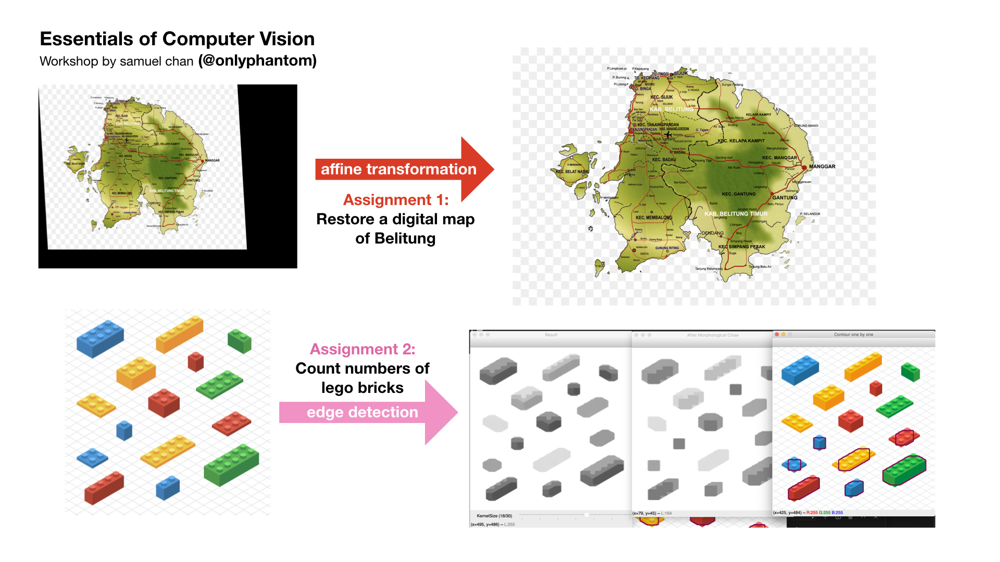

# Essentials of Computer Vision  

A math-first approach to learning computer vision in Python. The repository will contain all HTML, PDF, Markdown, Python Scripts, data, and media assets (images or links to supplementary videos). If you wish to contribute, I need translations for Bahasa Indonesia. Please submit a Pull Request.

## Study Guide
### Chapter 1
- Affine Transformation
    - [Definition](transformation/lecture_affine.html#definition)
        - [Mathematical Definitions](transformation/lecture_affine.html#mathematical-definitions)
    - [Practical Examples](transformation/lecture_affine.html#practical-examples)
    - [Motivation](transformation/lecture_affine.html#motivation)
    - [Getting Affine Transformation](transformation/lecture_affine.html#getting_affine-transformation)
        - [Trigonometry Proof](transformation/lecture_affine.html#trigonometry-proof)
    - [Code Illustrations](transformation/lecture_affine.html#code-illustrations)
    - [Summary and Key Points](transformation/lecture_affine.html#summary-and-key-points)
    - Optional video 
        - [Rotation Matrix Explained Visually](https://www.youtube.com/watch?v=tIixrNtLJ8U)
            - [w/ Bahasa Indonesia voiceover](https://www.youtube.com/watch?v=pWfXR_HmyUw)
    - References and learn-by-building modules

### Chapter 2
- Kernel Convolutions
    - [Definition](edgedetect/kernel.html#definition)
        - Optional video
            -  [Kernel Convolutions Explained Visually](https://www.youtube.com/watch?v=WMmHcrX4Obg)
        - [Mathematical Definitions](edgedetect/kernel.html#mathematical-definitions)
        - [Padding](edgedetect/kernel.html#a-note-on-padding)
    - [Smoothing and Blurring](edgedetect/kernel.html#smoothing-and-blurring)
    - [A Note on Terminology](edgedetect/kernel.html#a-note-on-terminology)
        - Kernels or Filters?
        -   Correlations vs Convolutions?
    - [Code Illustrations: Mean Filtering](edgedetect/kernel.html#code-illustrations-mean-filtering)
    - [Role in Convolution Neural Networks](edgedetect/kernel.html#role-in-convolutional-neural-networks)
    - [Handy Kernels for Image Processing](edgedetect/kernel.html#handy-kernels-for-image-processing)
        - [Gaussian Filtering](edgedetect/kernel.html#gaussian-filtering)
        - [Sharpening Kernels](edgedetect/kernel.html#sharpening-kernels)
        - [Gaussian Kernels for Sharpening](edgedetect/kernel.html#approximate-gaussian-kernel-for-sharpening)
        - [Unsharp Masking](edgedetect/kernel.html#unsharp-masking)
    - [Summary and Key Points](edgedetect/kernel.html#summary-and-key-points)
    - References and learn-by-building modules

### Chapter 3
- Edge Detection
    - [Definition](edgedetect/edgedetect.html#definition)
    - [Gradient-based Edge Detection](edgedetect/edgedetect.html#gradient-based-edge-detection)
        - [Sobel Operator](edgedetect/edgedetect.html#sobel-operator)
            - [Discrete Derivative](edgedetect/edgedetect.html#intuition-discrete-derivative)
            - [Code Illustrations: Sobel Operator](edgedetect/edgedetect.html#code-illustrations-sobel-operator)
        - [Gradient Orientation & Magnitude](edgedetect/edgedetect.html#dive-deeper-gradient-orientation-magnitude)
    - [Image Segmentation](edgedetect/edgedetect.html#image-segmentation)
        - [Intensity-based Segmentation](edgedetect/edgedetect.html#intensity-based-segmentation)
            - [Simple Thresholding](edgedetect/edgedetect.html#simple-thresholding)
            - [Adaptive Thresholding](edgedetect/edgedetect.html#adaptive-thresholding)
        - [Edge-based Contour Estimation](edgedetect/edgedetect.html#edge-based-contour-estimation)
            - [Contour Retrieval and Approximation](edgedetect/edgedetect.html#contour-retrieval-and-approximation)
    - [Canny Edge Detector](edgedetect/edgedetect.html#canny-edge-detector)
        - [Edge Thinning](edgedetect/edgedetect.html#edge-thinning)
        - [Hysteresis Thresholding](edgedetect/edgedetect.html#hysteresis-thresholding)
    - References and learn-by-building modules

### Chapter 4
- [Digit Classification](digitrecognition/digitrec.md)
    - A Note on Deep Learning
        - Why not MNIST?
    - Region of Interest
        - ROI identification
        - Arc Length and Area Size
            - Dive Deeper
        - ROI extraction
    - Morphological Transformations
        - Erosion
        - Dilation
        - Opening and Closing
        - Learn-by-building
    - Seven-segment display
        - Practical Strategies
            - Contour Properties
    - References and learn-by-building modules

## Future chapters
- Work in progress, but the full course will take the same philosophy of math-first learning, and possible topics that will feature in this course set includes convolutional neural networks, performing morphological operations, modern image segmentations techniques, video and web cam operations.

## Course Materials Preview:
### Python scripts

### PDF and HTML

## Workshops and Approach
The workshop will be delivered in English. Q&A Sessions will be in English and Bahasa Indonesia.

The intended audience for this course and accompanying workshop are absolute beginners who have an interest in computer vision and prefer to learn from ground up principles rather than a "apply-and-go tutorial approach".  

The first scheduled workshop is January 4, 2020, which serves as an introduction to this course. Future courses will follow an in-classroom coding sessions with supporting Teaching Assistants.

## Image Assets
- `car2.png`, `pen.jpg`, `lego.jpg` and `sudoku.jpg` are under Creative Commons (CC) license.

- `sarpi.jpg`, `castello.png`, `canal.png` and all other photography used are taken during my trip to Venice. 

- All other illustrations are created by me in Keynote. 

- Videos are created by me, and Bahasa Indonesia voice over on my videos is by [Tiara Dwiputri](https://github.com/tiaradwiputri)

## Badge of Completion
To earn a badge of completion, [attempt the quizzes](https://corgi.re/courses/onlyphantom/cvessentials) on https://corgi.re. [Corgi](https://corgi.re) is an aggregation tool for **co**u**r**ses on **gi**thub (hence the name) with a primary focus on data science and computer programming. 

Link to earn a badge: [Computer Vision Essentials | Corgi](https://corgi.re/courses/onlyphantom/cvessentials)

If you need help in the course, attend my in-person workshops on this topic (Computer Vision Essentials, free) throughout the course of the year.