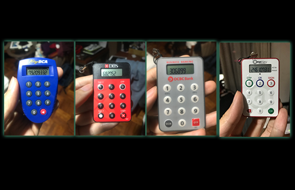
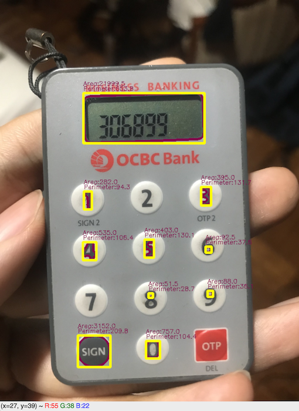
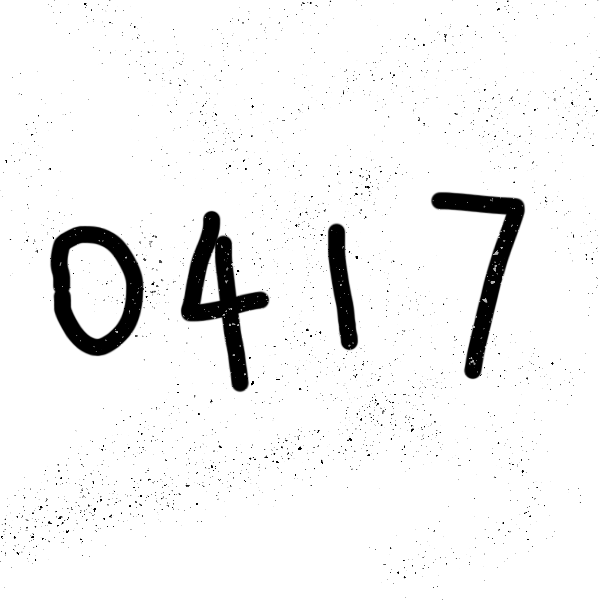
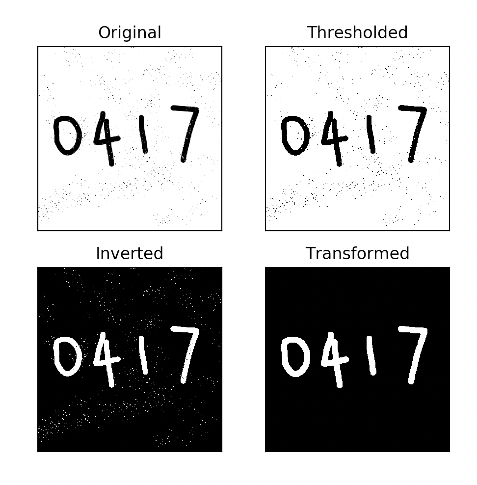
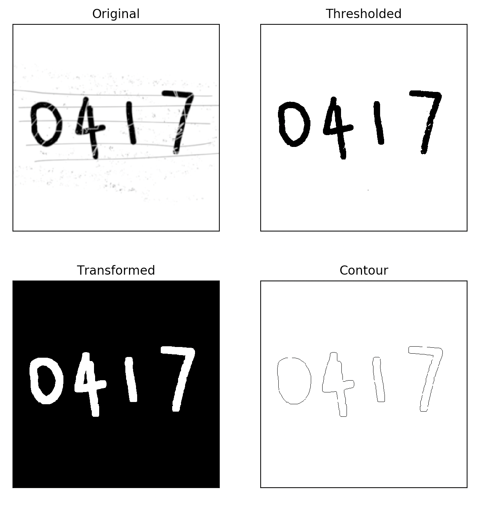
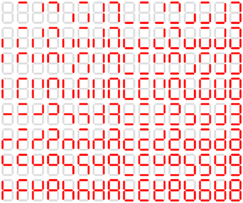
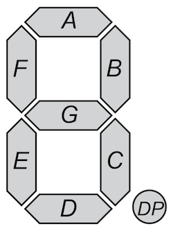
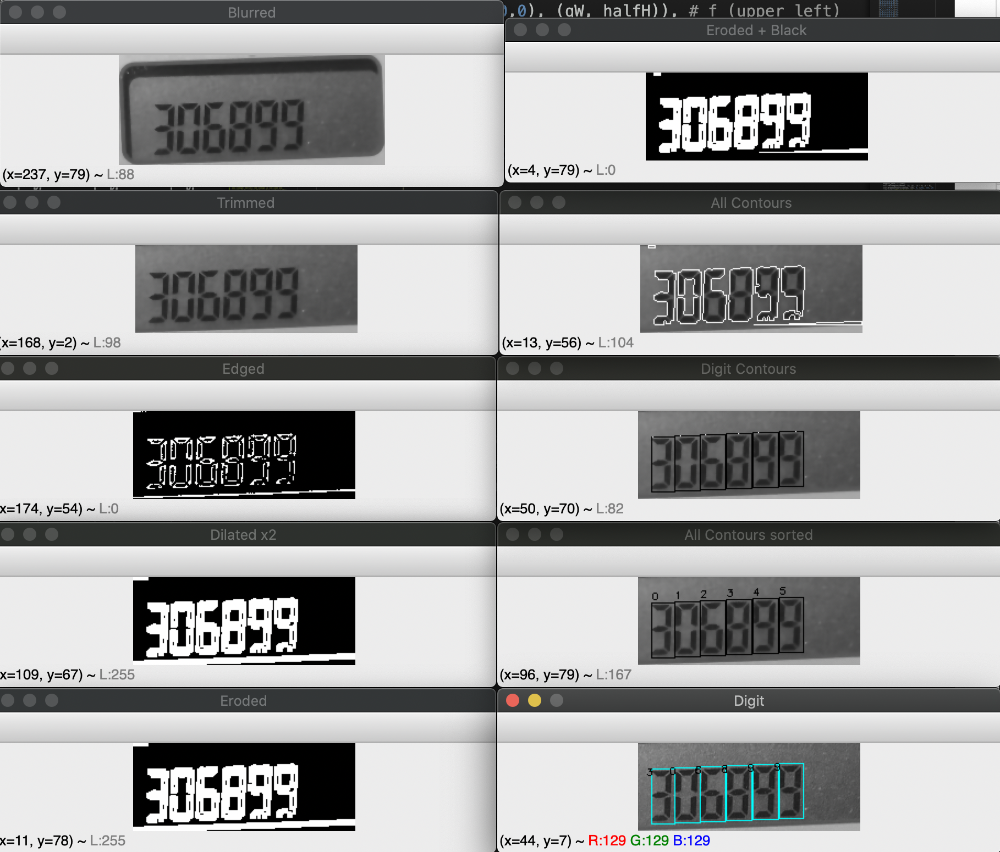

# Background
In Chapter 4: Digit Recognition, we'll add a few new techniques to our image processing toolset by attempting to build a digit recognition pipeline from start to finish. Throughout the exercise, we will get to practice the image preprocessing tricks we've picked up from previous chapters:
- Image manipulations such as resizing, cropping, rotation, color conversion  
- Blurring and sharpening operations
- Thresholding and Edge Detection
- Contour approximation

New method and strategies that you'll be learning include:
- Drawing operations (rectangles, text) on our image  
- Region of interest and bounding rectangles
- Morphological transformations
- The Seven-Segment Display 

## What about Deep Learning?
To be clear, specialised deep learning libraries that have sprung out in recent years are a lot more robust in their approach. By utilizing machine learning principles (cost function, gradient descent etc), these specialised libraries can handle highly complex object recognition and OCR (optical character recognition) tasks at the cost of brute computing power.

The overarching motivation of this free course however, was to make clear to beginners what constitutes artificial intelligence, and to illustrate the principle benefits of machine learning. I try to achieve that by demonstrating -- over multiple chapters of this course -- how computer visions were traditionally, or rather "classically", performed prior to the emergence of deep learning. 

By learning the classical approaches to computer vision, the student (you) can compare the effort it takes to hand-tuning parameters and this adds a new dimension of appreciation towards self-learning methods that we'll discuss in the near future.

## Region of Interest
Do a quick google search on "digit recognition" and it's hard to find an introductory deep learning course that **doesn't use** the famous MNIST (Modified National Institute of Standards and Technology)[^1] database. This is a handwritten digit database that has long become the _de facto_ in pretty much any machine learning tutorials:


But I'd argue, that for a budding computer vision developer, your learning objectives are better served by taking a different approach. 

By choosing real life images, you are confronted with a few more key challenges that are not present from using a well-curated database such as MNIST. These challenges present new opportunities to learn about key concepts such as **region of interest**, and **morphological operations**, that you will come to rely upon greatly in the future. 

First, take a look at 4 real-life pictures of security tokens issued by banks and institutional agencies (left-to-right: Bank Central Asia, DBS, OCBC Bank, OneKey for Singapore Government e-services): 



Notice how noisy these images are, as each image is shot with a different background, different lighting conditions, each token is of a different size and shape, and the different colors in each security token etc. 

Your task, as a computer vision developer, is to develop a pipeline that, in each phase, take you closer to the goal. Roughly speaking, given the above task, we would formulate a pipeline that looks like the following:
1. Preprocessing, noise reduction
2. Contour approximation
3. Find region of interest (ROI), that is the area of the LCD display in each of these pictures
4. Extract ROI for further preprocessing, discarding the rest of the image
5. Isolate each digit from the ROI
6. Iteratively classify each digit in the image
7. Combine the per-digit classification to a final string ("output")

In practice, step (1) and (2) above is the "application" of the methods you've learned in previous chapters of this series. As we'll soon observe, we will use a combination of blurring operations and edge detection to draw our contours. Among the contours, one of them would be the LCD display containing the digits to be classified. That is our **Region of Interest**.


### Selecting Region of Interest
The GIF above demonstrates the code in `roi_01.py` but essentially it shows the `selectROI` method in action. You'll commonly combined the `selectROI` method with a either a slicing operation to crop your region of interest, or a drawing operation to call attention to the specific region of the image.

```py
x,y,w,h = cv2.selectROI("Region of interest", img)
cropped = img[y:y+h, x:x+w]
# draw rectangle 
cv2.rectangle(img_color, (x,y), (x+w,y+h), (255,0,0), 2)
```

In most cases, it simply wouldn't be realistic to render an image before manually specifying our region of interest. We'll need this operation to be as close to automatic as possible. But how exactly? That depends greatly on the specific problem set. 

In some cases, the obvious choice of strategy would be simply shape recognition, say by counting the number of vertices from each contour. The following code is an example implementation of that:

```py
# cnt = contour
peri = cv2.arcLength(cnt, True)
# contour approximation
cnt_appro = cv2.approxPolyDP(cnt, 0.03 * peri, True)
if len(cnt_approx) == 3:
    est_shape = 'triangle'
...
elif len(cnt_approx) == 5:
    est_shape = 'pentagon'
...
```

In other cases, you may employ a strategy that try to match contour based on Hu moments (which we'll study in details in future chapters). 

Other methods may involve a saliency map, or a visual attention map, for ROI extraction. These methods create a new representation of the original image where each pixel's **unique quality** are amplified or emphasized. One example implementation on Wikipedia[^2] demonstrates how straightforward this concept really is:

$$SALS(I_K) = \sum^{N}_{i=1}|I_k-I_i|$$

As you add new tools and strategies to your computer vision toolbox, you will pick up new approaches to ROI extraction. It is an interesting field of research that has been gaining a lot in popularity with the emergence of deep learning.

As for the images of bank security tokens, can you think of an approach that may be a good fit? Our region of interest is the LCD screen at the top of the button pad on each device, and they all seem to be rather consistent in shape and size. Give it some thought and read on to find out.

### Arc Length and Area Size
I've hinted at the shape and size being a factor, so maybe that would be a good starting point. The good news is the OpenCV made this incredibly easy through the `contourArea()` and `arcLength()` function. 

The following snippet of code, lifted from `contourarea_01.py`, finds all contours and sort them by area size in descending order before storing the first 10 in `cnts`:
```py
cnts, _ = cv2.findContours(edged, cv2.RETR_EXTERNAL, cv2.CHAIN_APPROX_SIMPLE)
# sort contours by contourArea, and get the first 10
cnts = sorted(cnts, key=cv2.contourArea, reverse=True)[:9]
```

We can also obtain the contour area and parameter iteratively in a for-loop, like the following:
```py
cnts, _ = cv2.findContours(edged, cv2.RETR_EXTERNAL, cv2.CHAIN_APPROX_SIMPLE)
for i in range(len(cnts)):
    area = cv2.contourArea(cnts[i])
    peri = cv2.arcLength(cnts[i], closed=True)
    print(f'Area:{area}, Perimeter:{peri}')
```

In effect, we're looping through each contour that the `findContours()` operation found, and computing two values each time, `area` and `peri`. 

Note that the contour perimeter is also known as the arc length. The second argument `closed` specify whether the shape is a closed contour (`True`) or just a curve (`closed=False`). 

Execute `contourarea_01.py` and observe how each contour is displayed, from the one with the largest area to the one with the least, for a total of 10 contours. As you run the script on different pictures of bank security tokens, you see that it does a reliable job at finding the contours, sorting them, and returning our LCD display screen as the first in the list. This makes sense, because visually it is apparent that the LCD display occupy the largest area among other closed shapes in our picture.

#### Dive Deeper
1. Use `assets/dbs.jpg` instead of `assets/ocbc.jpg` in `contourarea_01.py`. Were you able to extract the region of interest (LCD Display) successfully without any changes to the script?

2. Could we have successfully extract our region of interest have we used `arcLength` in our strategy?

3. Supposed we only wanted to extract the region of interest and not the rest, which line of code would you change? Reflect the change in the code and execute it to confirm that you have performed this exercise correctly. 

4. Supposed we wanted the contours sorted according to their respective area, from the smallest to the largest, which line of code would you change? Reflect the change in the code and execute it to confirm that you have performed this exercise correctly.

While working through the exercises above, you may find it helpful to also draw the text describing the area size and perimeter next to each contour. I've shown you how this can be done in `contourarea_02.py` but the essential addition we make to the earlier code is the two calls to `putText()`:

```py
PURPLE = (75, 0, 130)
THICKNESS = 1
FONT = cv2.FONT_HERSHEY_SIMPLEX
cv2.putText(img_color, "Area:" + str(area), (x, y - 15), FONT, 0.4, PURPLE,THICKNESS)
cv2.putText(img_color, "Perimeter:" + str(peri), (x, y - 5), FONT, 0.4,PURPLE, THICKNESS)
```



### ROI extraction
With these foundations, we are now ready to write a simple utility script that:
1. Find our region of interest
2. Crop ROI into a new image
3. Save it into an folder named `/inter` (intermediary) for the actual digit recognition later

Much of what you need to do has already been presented so far, but the core pieces are, lifted from `roi_02.py` the following few lines of code:

```py
img = cv2.imread(...)
blurred = cv2.GaussianBlur(img, (7, 7), 0)
edged = cv2.Canny(blurred, 130, 150, 255)
cnts, _ = cv2.findContours(edged, cv2.RETR_EXTERNAL, cv2.CHAIN_APPROX_SIMPLE)
cnts = sorted(cnts, key=cv2.contourArea, reverse=True)[:1]

x, y, w, h = cv2.boundingRect(cnts[0])
roi = img[y : y + h, x : x + w]
cv2.imwrite("roi.png", roi)
```

The `roi_02.py` utility script uses the `argparse` library so user can specify a file path with a flag `-p` (or `--path`) like such:
```bash
python roi_02.py -p assets/ocbc.jpg
# equivalent:
python roi_02.py --path assets/ocbc.jpg
```

If the user do not specify a file path using the `-p` flag, the default value would be `assets/ocbc.jpg`. If you wish to change this, edit `roi_02.py` and specify a different value for the `default` parameter.

```py
parser = argparse.ArgumentParser()
parser.add_argument("-p", "--path", default="assets/ocbc.jpg")
```

You should run this exercise using `dbs.jpg`, `ocbc2.jpg`, or `onekey.jpg` at least once. Execute the script and check the `inter` folder to confirm that the ROI has been saved. When you're done, you are ready to move on to the next phase of the digit recognition pipeline. 

## Morphological Transformations
Once the region of interest is obtained, we now have an image that may still contain noises. This is especially the case when our ROI is obtained by means of thresholding methods, since you can expect some "non-features" (noises) to also be included in the resulting image. 

To account for these imperfections, we will now perform a series of operations on our image. We'll learn what they are formally, but let's begin by seeing what is it that they _offer_ to our image processing pipeline. I've included a picture with some random noise, as follow:



The digit "0417" is clearly discernible to the human eye despite the presence of noise. However, consider the perspective of a global thresholding operation; These pixel values are "noise" to us but a computer has no such notion of which pixel values are meaningful and what others are not. A thresold value such as the global mean will take all values into account indiscriminately. A contour finding operation will, instead of 4, return thousands of tiny round segments (they may be tiny, but they are completely valid contours). 

An image processing pipeline that fail to account for these may result in sub-optimal performance or, very often, completely undesired results. 

Enter two of the most fundamental morphological transformations: **erosion** and **dilation**. 

### Erosion
Erosion "erodes away the boundaries of foreground object"[^3] by sliding a kernel through the image and set a pixel to 1 **only if all the pixels under the kernel is 1**.

This in effect discard pixels near the boundary and any floating pixels that are not part of a larger blob (which is what the human eye is interested in). Because pixels are eroded, your foreground object will shrink in size.

### Dilation
The opposite of erosion, Dilation sets a pixel to 1 if **at least one pixel under the kernel is 1**, essentially "growing" the foreground object. 

Because of how these operations work, there are a couple of things to note:
1. Morphological transformations are usually performed on binary images. Recall that pixel values in binary images are either a full white (i.e 1) or black (i.e 0). 
2. As per convention, we want to keep our foregound in white and background in black  
3. Because erosion results in a shrinking foreground and dilation results in a growing foreground, these two operations are also commonly used in combinations, i.e erosion followed by dilation, or vice versa



As we read our image in grayscale mode (`flags=0`), we obtain a white blackground and a mostly-black foreground. This is illustrated in the subplot titled "Original" above. We begin our preprocessing steps by first binarizing the image (step 1), followed by inverting the colors (step 2) to get a white-on-black image. 

An erosion operation is then performed (step 3). This works by creating our kernel (either through `numpy` or through `opencv`'s structuring element) and sliding that kernel across our image to remove white noises in our image. 

The side-effect is that our foreground object has now shrunk in size as it's boundaries are eroded away. We grow it back by applying a dilation (step 4) and finally show the output as illustrated in the bottom-right pane of the image above.

```py
# read as grayscale
roi = cv2.imread("assets/0417s.png", flags=0)
# step 1: 
_, thresh = cv2.threshold(roi, 170, 255, cv2.THRESH_BINARY)
# step 2:
inv = cv2.bitwise_not(thresh)
# step 3 (option 1):
kernel = np.ones((5,5), np.uint8)
# step 3 (option 2):
kernel = cv2.getStructuringElement(cv2.MORPH_ELLIPSE, (5, 5))
eroded = cv2.erode(inv, kernel, iterations=1)
# step 4:
dilated = cv2.dilate(eroded, kernel, iterations=1)
cv2.imshow("Transformed", dilated)
cv2.waitKey(0)
```

### Opening and Closing
Another name for **Erosion, followed by Dilation** is the Opening. It is useful in removing noise in our image. The reverse of Opening is Closing, where we first **perform Dilation followed by Erosion**, particularly suited for closing small holes inside foreground objects.

OpenCV includes the more generic `morphologyEx` method for all other morphological operations beyond Erosion and Dilation. The function takes an image as the first argument, an operation as the second operation and finally the kernel. Compare how your code will differ between `cv2.erode` and `cv2.dilate`, and their respective equivalence in `cv2.morphologyEx()`:

```py
import cv2
import numpy as np

img = cv2.imread('image.png',0)
kernel = np.ones((5,5),np.uint8)
erosion = cv2.erode(img,kernel,iterations = 1)
# Equivalent:
# cv2.morphologyEx(img, cv2.MORPH_ERODE, kernel,iterations=1)
dilation = cv2.dilate(img,kernel,iterations = 1)
# Equivalent:
# cv2.morphologyEx(img, cv2.MORPH_DILATE, kernel,iterations=1)
opening = cv2.morphologyEx(img, cv2.MORPH_OPEN, kernel)
closing = cv2.morphologyEx(img, cv2.MORPH_CLOSE, kernel)
```

### Learn-by-Building
In the `homework` directory, you'll find `0417h.png`. Your job is to apply what you've learned in this lesson to clean up the image. Your output should have these qualities:
1. As free of noise as possible (remove the lines, and the red splatted dots across the image)
2. If you run `findContours()` on the output, you should have exactly 4 contours
3. Foreground object in white, background in black


You are free to pick your strategy, but a reference solution would look like the following:



## Seven-segment display
The seven-segment display (known also as "seven-segment indicator") is a form of electronic display device for displaying decimal numerals[^4] widely used in digital clocks, electronic meters, calculators and banking security tokens.



This is relevant because it is the character representation of our digits in each of these security tokens. If we can isolate each digit from each other, we can iteratively predict the "class" of each digit (0 to 9). Specifically, we are going to perform a classification task based on the state of each segment. 

To ease our understanding, let's refer to each segment using the letters A to G:



We can then create a lookup table that match the collective states to the corresponding class:

| Class 	| a 	| b 	| c 	| d 	| e 	| f 	| g 	|
|-------	|---	|---	|---	|---	|---	|---	|---	|
| 0 	| 1 	| 1 	| 1 	| 1 	| 1 	| 1 	| 0 	|
| 1 	| 0 	| 1 	| 1 	| 0 	| 0 	| 0 	| 0 	|
| 2 	| 1 	| 1 	| 0 	| 1 	| 1 	| 0 	| 1 	|
| 3 	| 1 	| 1 	| 1 	| 1 	| 0 	| 0 	| 1 	|
| 4 	| 0 	| 1 	| 1 	| 0 	| 0 	| 1 	| 1 	|
| 5 	| 1 	| 0 	| 1 	| 1 	| 0 	| 1 	| 1 	|
| 6 	| 1 	| 0 	| 1 	| 1 	| 1 	| 1 	| 1 	|
| 7 	| 1 	| 1 	| 1 	| 0 	| 0 	| 1 	| 0 	|
| 8 	| 1 	| 1 	| 1 	| 1 	| 1 	| 1 	| 1 	|
| 9 	| 1 	| 1 	| 1 	| 1 	| 0 	| 1 	| 1 	|


How would we represent such a lookup table in our Python code and how would we use it? The obvious answer to the first question is a dictionary. Notice that `DIGITSDICT` is just a representation of the "binary state" of each segment. The digit "8" for example correspond to all seven segments being activated, or "on" (state of `1`). 

```py
DIGITSDICT = {
    (1,1,1,1,1,1,0):0,
    (0,1,1,0,0,0,0):1,
    (1,1,0,1,1,0,1):2,
    (1,1,1,1,0,0,1):3,
    (0,1,1,0,0,1,1):4,
    (1,0,1,1,0,1,1):5,
    (1,0,1,1,1,1,1):6,
    (1,1,1,0,0,1,0):7,
    (1,1,1,1,1,1,1):8,
    (1,1,1,1,0,1,1):9
}
```

Then, for each digit, we would look at the pixel values in each of the seven segments, and if the majority of pixels are white, we would classify that segment as being in an activated state (`1`), otherwise in a state of `0`. As we iterate over the 7 segments, we now have an array of length 7, each element a binary value(`0` or `1`). 

We would then find the corresponding value in our dictionary using that array. Your code would resemble the following:

```py
# define the rectangle areas corresponding each segment
sevensegs = [
    ((x0, y0), (x1, y1)),
    ((x2, y2), (x3, y3)),
    ... # 7 of them
]

# initialize the state to OFF
on = [0] * 7 

# set each segment to ON / OFF based on majority
for (i, ((p1x, p1y), (p2x, p2y))) in enumerate(sevensegs):
    # numpy slicing to extract only one region
    region = roi[p1y:p2y, p1x:p2x]
    # if majority pixels are white, set state to ON
    if np.sum(region == 255) > region.size *0.5:
        on[i] = 1

# lookup on dictionary
digit = DIGITSDICT[tuple(on)] # digit is one of 0-9
```

There are multiple ways to write a for-loop but it's important that you are aware of the order in which your for-loop your executing. Referring to our seven-segment illustration below,the first iteration is only concerned with the state of 'A' while the second interation handles the state of 'B', and so on. 


Using `enumerate`, we obtain an additional counter (`i`) to our iterable (`sevensegs`); This is convenient for the purpose of setting states. At the first iteration, the first element is our list is conditionally set to 1 if more than half of the pixels in segment 'A' are white. A more detailed example of python's enumeration is in `utils/enumerate.py`.

### Practical Strategies
If you are paying close attention to the digit '0' in our LCD display, you will notice that the absence of the 'G' segment causes a pretty visible and significant gap. When you test your digit recognition script without special consideration to this attribute, you will find it consistently failing to account for the numbers "0","1" and "7". In fact, you may not even be able to isolate the aforementioned numbers altogether using the `findContour` operation, because they were treated as two disjointed pieces instead of a whole piece. 

A reasonable strategy to handle this is the Dilation or Closing (Dilation followed by Erosion) operation that you've learned earlier. 

#### Contour Properties
Furthermore, in many cases of digit recognition / digit classification you will want to predict the class for each digit in an ordered fashion. Supposed the LCD screen contains the digits "40710382", our algorithm should correctly isolate these digits, classify them iteratively, but do so from the leftmost digit to the rightmost. Failing to account for this may result in your algorithm correctly classifying each digit, but produce an unreasonable output such as "1740238". 

There are a few strategies you can employ here. We've seen in  `contourarea_01.py` and `contourarea_02.py` how contour has attributes that can be retrieved using the `contourArea()` and `arcLength()` functions. Inspect the following snippet and it should help jog your memory:

```py
cnts = sorted(cnts, key=cv2.contourArea, reverse=True)[:9]

for i, cnt in enumerate(cnts):
    cv2.drawContours(img_color, cnts, i, BCOLOR, THICKNESS)
    area = cv2.contourArea(cnt)
    peri = cv2.arcLength(cnt, closed=True)
    print(f"Area:{area}; Perimeter: {peri}")
```

Indeed, we're using countour area as a good indicator to search for our region of interest. When we take this idea a little further, we can further place a constraint on our search criteria. In the following code, we draw a bounding rectangle and for an extra layer of precaution, only takes any bounding boxes that are taller than 20 pixels (step 1).

Calling `boundingRect()` on a contour returns 4 values, respectively the x and y coordinate along with the width and height of the contour. 

We then use another property of the contour, its top-left coordinate to determine the logical order of our digits. Specifically, we use the first returned value (`cv2.boundingRect(cnt)[0]`) since that's the x value for the top-left coordinate of each region. By sorting against this value, our digits are stored in the Python list in an ordered fashion, determined by their respective coordinate value. 

```py
digits_cnts = []
cnts, _ = cv2.findContours(eroded, cv2.RETR_EXTERNAL, cv2.CHAIN_APPROX_SIMPLE)
for cnt in cnts:
    (x, y, w, h) = cv2.boundingRect(cnt)
    # step 1
    if h > 20:
        digits_cnts += [cnt]
# step 2
sorted_digits = sorted(digits_cnts, key=lambda cnt: cv2.boundingRect(cnt)[0])
```

When we put these together, we now have a complete pipeline.  


# References
[^1]: LeCun, Y., Bottou, L., Bengio, Y., and Haffner, P. (1998). Gradient-based learning applied to document recognition. Proceedings of the IEEE, 86, 2278–2324
[^2]: Saliency map, Wikipedia
[^3]: Morphological Transformations, OpenCV Documentation
[^4]: Seven-segment display, Wikipedia
[^5]: Seven-segment display character representations, Wikipedia


