# Definition
An edge can be defined as boundary between regions in an image[^1]. Edge detection techniques we'll learn in this course builds upon what we've learned from our lessons in kernel convolution. It is the process of using kernels to reduce the information in our data and preserving only the necessary structural properties in our image[^1].

# Gradient-based Edge Detection
Gradient points in the direction of the most rapid increase in intensity. When we apply a gradient based edge detection method, we are searching for the maximum and minimum in the first derivative of the image. 

When we apply our convolution onto the image, we are finding for regions in the image where there's a sharp change in intensity or color. Arguably the most common edge detection method using this approach is the Sobel Operator. 

## Sobel Operator
The `Sobel` operator applies a filtering operation to produce an image output where the edge is emphasized. It convolves our original image using two 3x3 kernels to capture approximations of the derivatives in both the horizontal and vertical directions.

The x-direction and y-direction kernels would be: 

$$G_x = \begin{bmatrix} 1 & 0 & -1 \\ 2 & 0 & -2 \\ 1 & 0 & -1  \end{bmatrix}
 G_y = \begin{bmatrix} 1 & 2 & 1 \\ 0 & 0 & 0 \\ -1 & -2 & -1  \end{bmatrix}
$$

Each kernel is applied separately to obtain the gradient component in each orientation, $G_x$ and $G_y$. Expressed in formula, the gradient magnitude is:
$$|G| = \sqrt{G^2_x + G^2_y} $$

Where the slope $\theta$ of the gradient is calculated as follow:
$$\theta(x,y)=tan^{-1}(\frac{G_y}{G_x})$$

If the two formula above confuses you, read on as we unpack these ideas one at a time. 

### Intuition: Discrete Derivative
In computer vision literature, you'll often hear about "taking the derivative" and this may erve as a source of confusion for beginning practitioners since "derivatives" is often thought of in the context of a continuous function. Images are a 2D matrix of discrete values, so how do we wrap our head around the idea of finding derivative?

But why do we even bother with derivatives when this course is suppopsed to be about edge detection in images? 

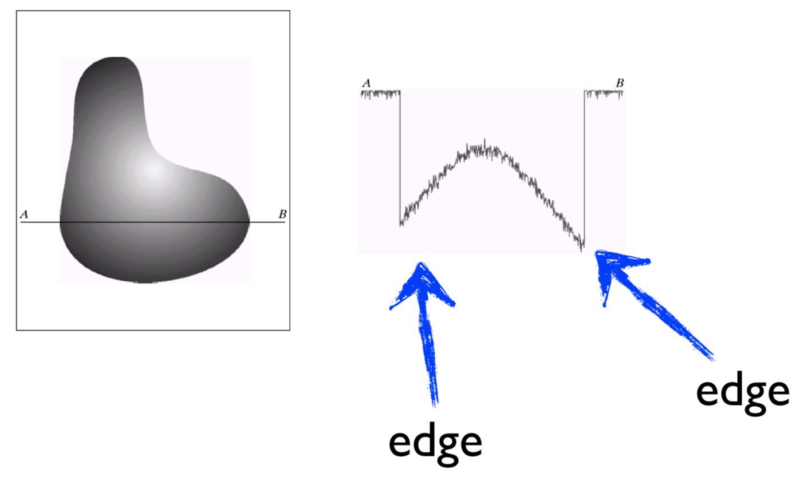

Among the many ways to answer the question, my favorite being that image is really just a function. When it treat an image as a function, the utility of taking derivatives become a little more obvious. In the image below, supposed you want to count the number of windows in this area of Venezia Sestiere Cannaregio, your program can look for large derivatives since there are sharp changes in pixel intensity from the windows to the surrounding wall:

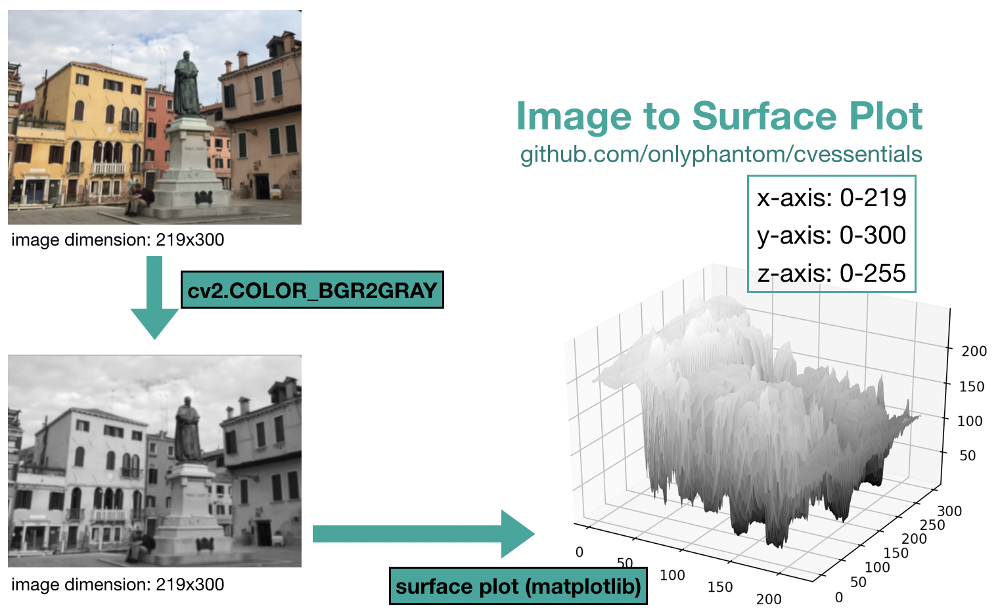

The code to generate the surface plot above is in `img2surface.py`.

Going back to our x-direction kernel in the Sobel Operator. 
This kernel has all 0 in the middle, which is quite easy to intuit about. Essentially, for each pixel in our image, we want to compute its derivative in the x-direction by approximating a formula that you may have come across in your calculus class:

$$f'(x) = \lim_{h\to0}\frac{f(x+h)-f(x)}{h}$$

This approximation is also called 'forward difference', because we're taking a value of $x$, and computing the difference in $f(x)$ as we increment it by a small amount forward, denoted as $h$. 

And as it turns out, using the 'central difference' to compute the derivative of our discrete signal can deliver better results[^2]:

$$f'(x) = \lim_{h\to0}\frac{f(x+0.5h)-f(x-0.5h)}{h}$$

To make this more concrete, we can plug the formula into an actual array of pixels:

$$[0, 255, 65, \underline{180}, 255, 255, 255]$$

when we set $h=2$ at the center pixel (index of value 180), we have the following:

$$\begin{aligned}
f'(x) & = \lim_{h\to0}\frac{f(x+0.5h)-f(x-0.5h)}{h}\\
& = \frac{f(x+1)-f(x-1)}{2} \\
& = \frac{255-65}{2} \\ 
& = 95 \end{aligned}$$

Notice that a large part of the calculation we just perform is synonymous to a 1D convolution operation using a $\begin{bmatrix} -1 & 0 &  1 \end{bmatrix}$ kernel. 

When the same 1x3 kernel $\begin{bmatrix} -1 & 0 &  1 \end{bmatrix}$ is applied on the right-most part of the image where its just white space ([..., 255, 255, 255]) the kernel would evaluate to 0. In other words, our derivative filter returns no response where it can't detect a sharp change in pixel intensity.

As a reminder, the x-direction kernel in our Sobel Operator is the following:
$$G_x = \begin{bmatrix} 1 & 0 & -1 \\ 2 & 0 & -2 \\ 1 & 0 & -1  \end{bmatrix}$$

This takes our 1x3 kernel and instead of convolving one row of pixels at a time, extends it to convolve at 3x3 neighborhoods at a time using a weighted average approach.

### Code Illustrations: Sobel Operator
The two kernels (one for horizontal and another for vertical edge detection) can be constructed, respectively, like the following:

```py
sobel_x = np.array([[1, 0, -1],
                    [2, 0, -2],
                    [1, 0, -1]])

sobel_y = np.array([[1, 2, 1],
                    [0, 0, 0],
                    [-1, -2, -1]])
```

You may have guessed that, given its role in digital image processing, `opencv` have included a method that performs our Sobel Operator for us, and thankfully there is. Here's an example of using the `cv2.Sobel(src, ddepth, dx, dy, dst=None, ksize)` method:

```py
gradient_x = cv2.Sobel(img, cv2.CV_64F, 1, 0, ksize=3)
gradient_y = cv2.Sobel(img, cv2.CV_64F, 0, 1, ksize=3)
print(f"Range: {np.min(gradient_x)} | {np.max(gradient_x)}")
# Range: -177.0 | 204.0

gradient_x = np.uint8(np.absolute(gradient_x))
gradient_y = np.uint8(np.absolute(gradient_y))
print(f"Range uint8: {np.min(gradient_x)} | {np.max(gradient_x)}")
# Range uint8: 0 | 204

cv2.imshow("Gradient X", gradient_x)
cv2.imshow("Gradient Y", gradient_y)
```
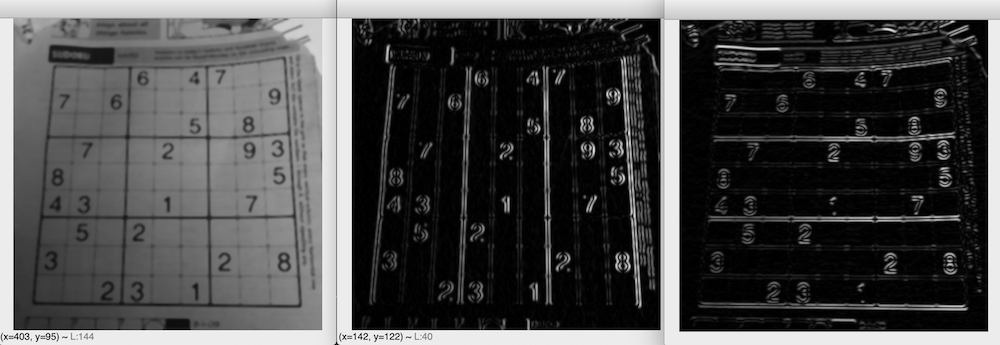

The code above, extracted from `sobel_01.py` reinforces a couple of ideas that we've been working on. It shows that:
- the $G_x$ and $G_y$, gradients of the image, are computed separately through the convolution of two different Sobel kernels
- $G_x$ and $G_y$ responded to the change in pixel values along the x-direction and y-direction respectively, as visualized in the illustration above
- convolution using the two Sobel filters may, and often will, produce a value outside the range of 0 and 255. Given the presence of [-1, -2, -1]  in one side of our kernel, mathematically this may lead to an output value of -1020. To store the values from these convolutions we use a 64-bit floating point (`cv2.CV_64F`). OpenCV suggests to "keep the output datatype to some higher form such as `cv2.CV_64F`, take its absolute value and then convert back to `cv2.CV_8U`.[^3]"

While the code above certainly works, OpenCV also has a method that scales, calculates absolute values and converts the result to 8-bit. `cv2.convertScaleAbs(src, dst, alpha=1, beta=0)` performs the following:
$$dst(I) = cast<uchar>(|src(I) * \alpha + \beta|)$$

```py
gradient_x = cv2.Sobel(img, cv2.CV_64F, 1, 0, ksize=3)
gradient_y = cv2.Sobel(img, cv2.CV_64F, 0, 1, ksize=3)

gradient_x = cv2.convertScaleAbs(gradient_x)
gradient_y = cv2.convertScaleAbs(gradient_y)
print(f"Range: {np.min(gradient_x)} | {np.max(gradient_x)}")
```

### Dive Deeper: Gradient Orientation & Magnitude
At the beginning of this course I said that images are really just 2d functions before showing you the intricacies of our Sobel kernels. We saw the clever design of both the x- and y-direction kernels, by borrowing from the concept of "taking the derivatives" you often see in calculus text books. 

But on a really basic level, these kernels only return the x and y edge responses. These are **not the image gradient**, just pure arithmetic values from following the convolution process. To get to the final form (where the edges in our image are emphasized) we still need to compute the gradient direction and magnitude for each point in our image. 

This brings us back to our original formula. Recall that the x-direction and y-direction kernels are: 

$$G_x = \begin{bmatrix} 1 & 0 & -1 \\ 2 & 0 & -2 \\ 1 & 0 & -1  \end{bmatrix}
 G_y = \begin{bmatrix} 1 & 2 & 1 \\ 0 & 0 & 0 \\ -1 & -2 & -1  \end{bmatrix}
$$

We understand that each kernel is applied separately to obtain the gradient component in each orientation, $G_x$ and $G_y$. What is the significance of this? Well as it turns out if we know the shift in the x-direction and the corresponding change in value in the y-direction, then we can use the pythagorean theorem to approximate the "length of the slope", a concept that many of you are familiar with. 

Expressed in formula, the gradient magnitude is hence:
$$|G| = \sqrt{G^2_x + G^2_y} $$

Along with the well-known mathematical formula that is Pythagorean theorem, some of you may also have some familiarity with the three trigonometric functions. Particularly, the tangent function tells us that in a right triangle, the **tangent of an angle is the length of the opposite side divided by the length of the adjacent side**.

This leads us to the following expression:
$$tan(\theta_{(x,y)})=\frac{G_y}{G_x}$$

To rewrite the expression above, we arrive at the formula to capture the gradient's direction:
$$\theta_{(x,y)}=tan^{-1}(\frac{G_y}{G_x})$$

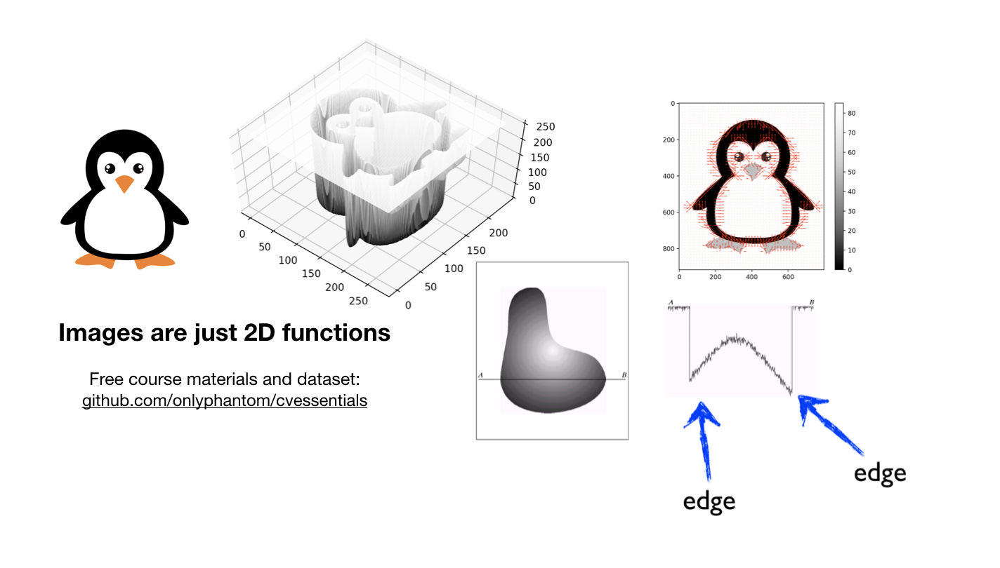

This whole idea is also illustrated in code, and the script is provided to you: 
- `gradient.py` to generate the vector field in the picture above (right)
- `img2surface.py` on the penguin image in the `assets` folder generates the surface plot

Succinctly, supposed the two 3x3 kernels do not fire a response (for example when no edges are detected in the white background of our penguin), both $G_x$ and $G_y$ will be 0, which leads to a gradient magnitude of 0. You can compute these by hand, let OpenCV's implementation handle that for you, or use `numpy` as illustrated in `gradient.py`:

```py
dY, dX = np.gradient(img)
```

# Image Segmentation
Image segmentation is the process of decomposing an image into parts for further analysis. This has many utility:

- Background subtraction in human motion analysis
- Multi-object classification
- Find region of interest for OCR (optical character recognition)
- Count pedestrians from a streamed video source
- Isolating vehicle registration plates (license plate) and vehicle models from a busy highway scene

Current literature on image segmentation techniques can be classified into[^4]:
- Intensity-based segmentation
- Edge-based segmentation
- Region-based semantic segmentation

It's important to note, however, that the rise in popularity of deep learning framework and techniques has ushered a proliferation of new methods to perform what was once a highly difficult task. In future lectures, we'll explore image segmentation in far greater details. In this course, we'll study intensity-based segmentation and edge-based segmentation methods.

## Intensity-based Segmentation
Intensity-based method is perhaps the simplest as intensity is the simplest property that pixels can share. 

To make a more concrete case of this, let's assume you're working with a team of researchers to build an AI-based "sudoku solver" that, unimaginatively, will compete against human sudoku players in an attempt to further stake the claim in an ongoing debate of AI superiority. 

While your teammates work on the algorithmic design for the actual solver, your task is comparatively straightforward: write a script to scan newspaper images (or print magazines), binarize them to discard everything except the digits in the sudoku puzzle.

This presents a great opportunity to use an intensity-based segmentation technique we spoke about earlier.

In `intensitytresholding_01.py`, you'll find a code demonstration of the numerous thresholding methods provided by OpenCV. In total, there are 5 simple thresholding methods: `THRESH_BINARY`, `THRESH_BINARY_INV`, `THRESH_TRUNC`, `THRESH_TOZERO` and `THRESH_TOZERO_INV`[^5]. 

### Simple Thresholding
The method call between all of them are identical:
```py
cv2.threshold(img, thresh, maxval, type)
```
We specify our source image `img` (usually in grayscale), a threshold value `thresh` used to binarize the image pixels, and a max value `maxval` for the pixel value to use for any pixel that crosses our threshold. 

The mathematical functions for each one of them:
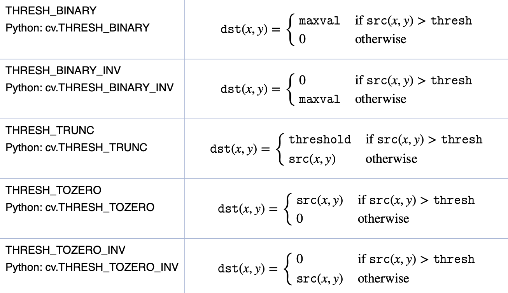

They're collectively known as **simple thresholding** in OpenCV because they use a global threshold value; Any pixels smaller than the threshold is set to 0 otherwise it is set to the `maxval` value. 

The probably sound too simplistic for anything beyond the simplest of real-world images, and for the majority of cases they are. They call for proper judgment of the task at hand. 

Applying the various types of simple thresholding method on our sudoku image, we observe that the digits are for the most part extracted successfully while the background information are greatly reduced:

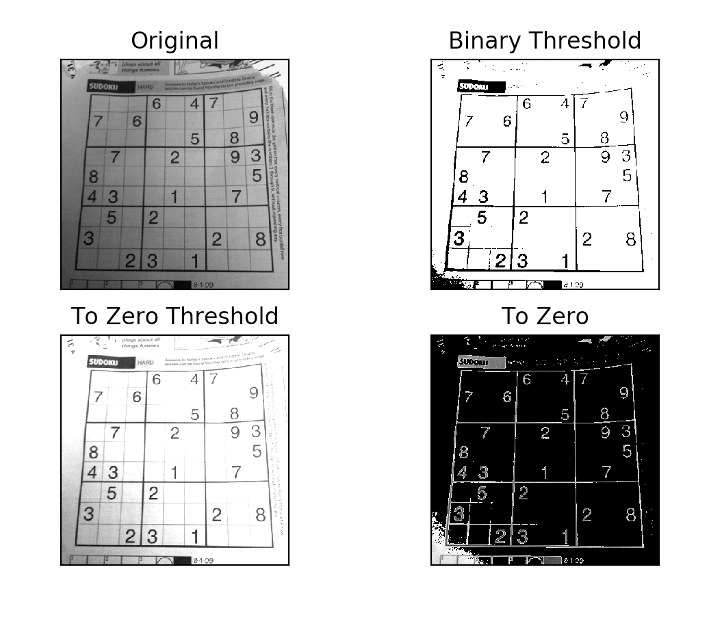

Refer to`intensitythresholding_01.py` for the full code. 

As a simple homework, try to practice **simple thresholding** on the `car2.png` located in your `homework` folder. To reduce noise, you may have to combine a blurring operation prior to thresholding. As you practice, pay attention to the interaction between your threshold values and the output. Later in the course, you'll learn how to draw contours, which would come in handy in producing the final output:


As you work on your homework, you will notice that given the varying lighting condition across the different region of our image, regardless of the global value we pick we either have a threshold value that is too low or too high. 

### Adaptive Thresholding
Using a global value as an intensity threshold may work in particular cases but may be overly naive to perform well when, say, an image has different lighting conditions in different areas. A great example of this case is the object extraction exercise you performed using `car2.png`.

Adaptive thresholding is not a lot different from the aforementioned thresholding techniques, except it determines the threshold for each pixel based on its neighborhood. This in effect mans that the image is assigned different thresholds across the different regions, leading to a cleaner output when our image has different degrees of illumination.

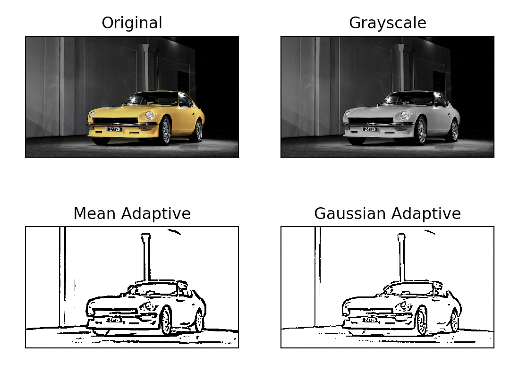

The method is called with the source image (`src`), a max value (`maxValue`), the method (`adaptiveMethod`), a threshold type (`thresholdType`), the size of the neighborhood (`blockSize`) and a constant (`C`) that is subtracted from the mean or the weightted sum of the neighborhood pixels. 

```py
mean_adaptive = cv2.adaptiveThreshold(
    img, 255, cv2.ADAPTIVE_THRESH_MEAN_C, cv2.THRESH_BINARY, 11, 2
)
gaussian_adaptive = cv2.adaptiveThreshold(
    img, 255, cv2.ADAPTIVE_THRESH_GAUSSIAN_C, cv2.THRESH_BINARY, 11, 2
)
```

The code, taken from `adaptivethresholding_01.py` produces the following:
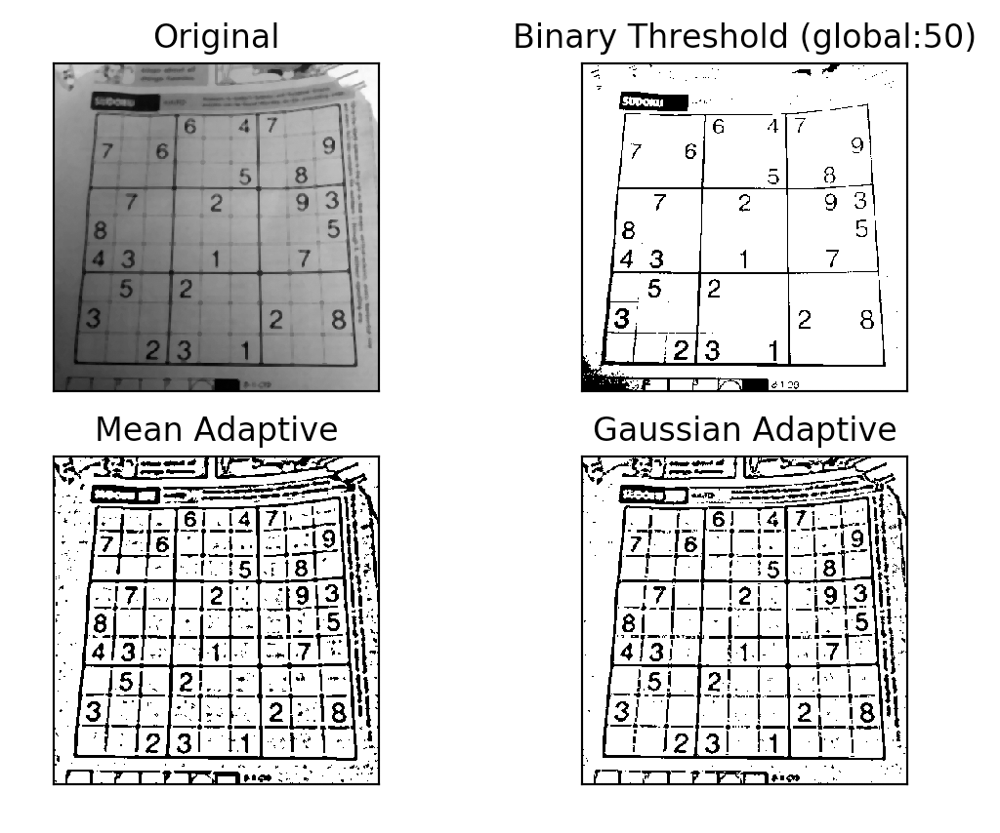

## Edge-based contour estimation
Edge-based segmentation separates foreground objects by first identifying all edges in our image. Sobel Operator and other gradient-based filter function are good and well-known candidates for such an operation.[^6] 

Once we obtain the edges, we perform the contour approximation operation using the `findContours` method in OpenCV. But what exactly are contours?

In OpenCV's words[^7],
> Contours can be explained simply as a curve joining all the continuous points (along the boundary), having same color or intensity. The contours are a useful tool for shape analysis and object detection and recognition.

If we have "a curve joining all the continuous points along the boundary", then we are able to extract this object. If we wish to count the number of contours in our image, the method also convenient return a list of all the found contours, making it easy to perform `len()` on the list to retrieve the final value.

There are three arguments to the `findContours()` function, first being the source image, second is the retrieval mode and last is the contour approximation method. Both the contour retrieval mode and approximation method is discussed in the next sub-section.
```py
(cnts, hierarchy) = cv2.findContours(
    img,
    cv2.RETR_EXTERNAL,
    cv2.CHAIN_APPROX_SIMPLE,
)
```
The function returns the contours and hierarchy, with contours being a list of all the contours in the image. Each contour is a Numpy array of `(x,y)` coordinates of boundary points of the object, giving each contour a shape of `(n, x, y)`.


What this allow us to do, is to combine the contours we retrieved with the `cv2.drawContours()` function either individually, exhaustively in a for-loop fashion, or just everything in one go.

Assuming `img` being the image we want to draw our contours on, the following code demonstrates these different methods:
```py
# draw all contours
cv2.drawContours(img, cnts, -1, (0,255,0), 3)
# draw the 3rd contour
cv2.drawContours(img, cnts, 2, (0,255,0), 3)
# draw the first, fourth and fifth contour
cnt_selected = [cnts[0], cnts[3], cnts[4]]
cv2.drawContours(canvas, cnt_selected, -1, (0, 255, 255), 1)
# draw the fourth contour
cv2.drawContours(img, contours, 3, (0,255,0), 3)
```
The first argument to this function being the source image, the second is the contours as a Python list, the third is the index of contours and remaining arguments are color and thickness of contour lines respectively.

One common problem beginners can run into is to perform the `findContours` operation on the grayscale image instead of the binary image, leading to poorer accuracy.

When we execute `contour_01.py`, we notice that the `drawContour` operation yields the following output:

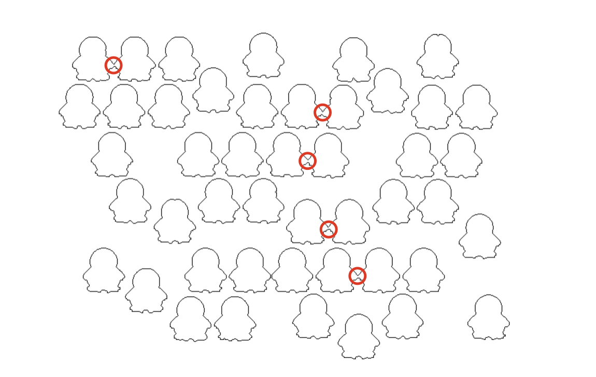

There are 5 occurrences where our `findContours` function incorrectly approximated the wrong contour because two penguins were too close to each other. When we execute `len(cnts)`, we will find that the returned value is 5 less than the actual count. 

Try to fix `contour_01.py` by performing the contour approximation on our binary image using the thresholding technique you've learned in previous section.  

### Contour Retrieval and Approximation
In the `findContours()` function call, we passed our image to `src` in the first argumet. The second argument is the contour retrieval mode, and there are documentation for 4 of them[^8]:
- `RETR_EXTERNAL`: retrieves only the extreme outer contours (see image below for reference)
- `RETR_LIST`: retrieves all contours without establishing any hierarchical relationships
- `RETR_CCOMP`: retrieves all contours and organize them into a two-level hierarchy (external boundary + boundaries of the holes)
- `RETR_TREE`: retrieves all of the contours and reconstructs a full hierarchy of nested contours

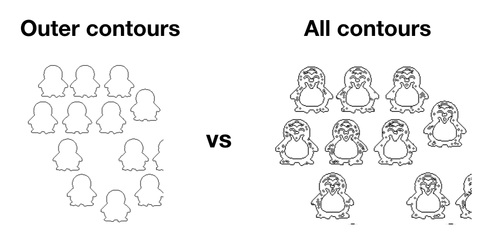

In our case, we don't particularly care about the hierarchy, and so the second to fourth method all has the same effect. In other cases, you may experiment with a different contour retrieval method to obtain both the contours and the hierarchy for further processing.

What about the last parameter passed to our `findContours` method? 

Recall that contours are just boundaries of a shape? In a sense, it is an array of `(x,y)` coordinates used to "record" the boundary of a shape. Given this collection of coordinates, we can then recreate the boundary of our shape. This begs the next question: how many set of coordinates do we need to store to recreate our boundary?

Supposed we perform the `findContour` operation on an image of two rectangles, one method it may use to achieve that is to store as many points around these rectangle boxes as possible? When we set `cv2.CHAIN_APPROX_NONE`, that is in fact what the algorithm would do, resulting in 658 points around the border of the top rectangle:


However, notice the more efficient solution would have been to store only the 4 coordinates at each corner of the rectangle. The contour is perfectly represented and recreated using just 4 points for each rectangle, resulting in a total number of 8 points compared to 1,316 points. `cv2.CHAIN_APPROX_SIMPLE`[^9] is an implementation of this, and you can find the sample code below: 

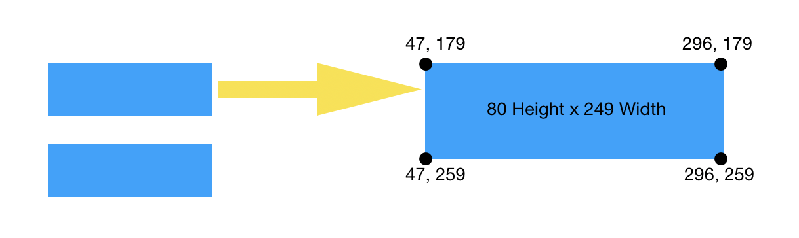

```py
cnts, _ = cv2.findContours(
        # does this need to be changed?
        edged,
        cv2.RETR_EXTERNAL,
        cv2.CHAIN_APPROX_SIMPLE,
    )
print(f"Cnts Simple Shape (1): {cnts[0].shape}")
# return: Cnts Simple Shape (1): (4, 1, 2)
# output of cnts[0]:
# array([[[ 47, 179]],
#       [[ 47, 259]],
#       [[296, 259]],
#       [[296, 179]]], dtype=int32)

cnts2, _ = cv2.findContours(
        # does this need to be changed?
        edged,
        cv2.RETR_EXTERNAL,
        cv2.CHAIN_APPROX_NONE,
    )
print(f"Cnts NoApprox Shape:{cnts2[0].shape}")
# Cnts NoApprox Shape:(658, 1, 2)
```
The full script for the experiment above is in `contourapprox.py`.

You may, at this point, hop to the Learn By Building section to attempt your homework.

# Canny Edge Detector
John Canny developed a multi-stage procedure that, some 30 years later, is "still a state-of-the-art edge detector"[^10]. Better edge detection algorithms usually require greater computational resources -- and consequently -- longer processing times -- or a greater number of parameters, in an area where algorithm speed is oftentimes the most important criteria. For the reasons above along with its general robustness, the canny edge algorithm has become one of the "most important methods to find edges" even in modern literature[^1].

I said it's a multi-stage procedure, because the technique as described in his original paper, _computational theory of edge detection_, works as follow[^11]:
1. Gaussian smoothing
    - Noise reduction using a 5x5 Gaussian filter
2. Compute gradient magnitudes and angles
3. Apply non-maximum suppression (NMS) 
    - Suppress close-by edges that are non-maximal, leaving only local maxima as edges
4. Track edge by hysteresis
    - Suppress all other edges that are weak and not connected to strong edges and link the edges

Step (1) and (2) in the procedure above can be achieved using code we've written so far in our Sobel Operator scripts. We use the Sobel mask filters to compute $G_x$ and $G_y$, respectively the gradient component in each orientation. We then compute the gradient magnitude and the angle $\theta$:

Gradient magnitude:
$$|G| = \sqrt{G^2_x + G^2_y} $$

And recall that the slope $\theta$ of the gradient is calculated as follow:
$$\theta(x,y)=tan^{-1}(\frac{G_y}{G_x})$$

## Edge Thinning
Step (3) in the procedure is another common technique in computer vision known as the non-maximum suppression (NMS). Let's begin by taking a look at the output of our Sobel edge detector from earlier exercises:
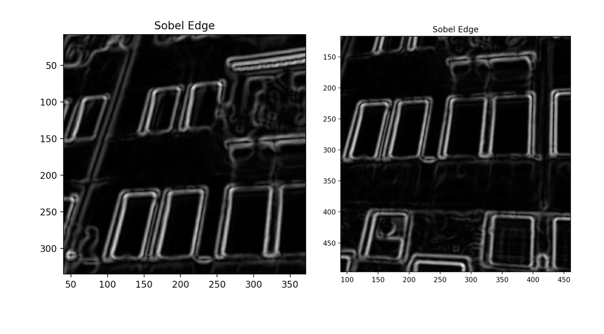

Notice as we zoom in on the output image, we can see the gradient-based method did create our strong edges, but it also created "weak" edges it find in our image. Because it is not a parameterized function -- the edge is computed using values of the gradient magnitude and direction -- we have to rely on an additional mechanism for the edge thinning operation with the criterion being one accurate response to any given edge[^12].

Non-maximum suppression help us obtain the strongest edge by suppressing all the gradient values, i.e. setting them to 0 except for the local maxima, which indicate locations with the sharpest change of intensity value. In the words of `OpenCV`:
> After getting gradient magnitude and direction, a full scan of image is done to remove any unwanted pixels which may not constitute the edge. For this, at every pixel, pixel is checked if it is a local maximum in its neighborhood in the direction of gradient. If point A is on the edge, and point B and C are in gradient directions, point A is checked with point B and C to see if it forms a local maximum. If so, it is considered for next stage, otherwise, it is suppressed (put to zero).

The output of step (3) is a binary image with thin edges.

The code[^13] demonstrates how you would code such an NMS for the purpose of canny edge detection. 

## Hysteresis Thresholding
The final step of this multi-stage algorithm decides which among all edges are really edges and which of them are not. It accomplishes this using two threshold values, specified when we call the `cv2.Canny()` function:

```py
canny = cv2.Canny(img, threshold1=50, threshold2=180)
```

Any edges with an intensity gradient above `threshold2` are considered edges and any edges below `threshold1` are considered non-edges and so are suppressed. 

The edges that lie between these two values (in our code above, edges with intensity gradient between 50 and 180) are classified as edges **if they are connected to sure-edge pixels** (the ones above 180) otherwise they are also discarded.

This stage also removes small pixels ("noises") on the assumption that edges are long lines ("connected").

The full procedure is implemented in a single function, `cv2.Canny()` and the first three parameters are required, respectively being the input image, the first and second threshold value. `canny_01.py` implements this and compare that to the Sobel Edge detector we developed earlier:

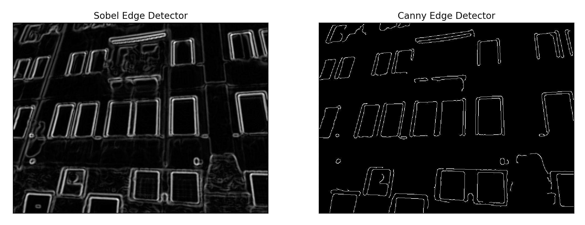

## Learn By Building
In the `homework` directory, you'll find a picture of scattered lego bricks `lego.jpg`. Exactly the kind of stuff you don't want on your bedroom floor, as anyone living with kids at home would testify. 

Your job is to apply what you've learned in this lesson to combine what you've learned from the class in kernel convolutions and Edge Detection (`kernel.md`) to build a lego brick counter.

Note that there are many ways you can build an edge detection. Given what you've learned so far, there are at least 3 equally adequate routines you can apply for this particular problem set. 

For the sake of this exercise, your script should feature the use of a Sobel Operator (or a similar gradient-based edge detection method) since this is the main topic of this chapter. 


## References
[^1]: S.Kaur, I.Singh, Comparison between Edge Detection Techniques, International Journal of Computer Applications, July 2016

[^2]: Carnegie Mellon University, Image Gradients and Gradient Filtering (16-385 Computer Vision) 

[^3]: Image Gradients, [OpenCV Documentation](https://opencv-python-tutroals.readthedocs.io/en/latest/py_tutorials/py_imgproc/py_gradients/py_gradients.html)

[^4]: University of Victoria, Electrical and Computer Engineering, Computer Vision: Image Segmentation

[^5]: Image Thresholding, [OpenCV Documentation](https://docs.opencv.org/master/d7/d4d/tutorial_py_thresholding.html)

[^6]: C.Leubner, A Framework for Segmentation and Contour Approximation in Computer-Vision Systems, 2002

[^7]: Contours: Getting Started, [OpenCV Documentation](https://docs.opencv.org/trunk/d4/d73/tutorial_py_contours_begin.html)

[^8]: Structural Analysis and Shape Descriptors, [OpenCV Documentation](https://docs.opencv.org/master/d3/dc0/group__imgproc__shape.html#ga819779b9857cc2f8601e6526a3a5bc71)

[^9]: Contours Hierarchy, [OpenCV Documentation](https://docs.opencv.org/trunk/d9/d8b/tutorial_py_contours_hierarchy.html)

[^10]: Shapiro, L. G. and Stockman, G. C, Computer Vision, London etc, 2001

[^11]: Bastan, M., Bukhari, S., and Breuel, T., Active Canny: Edge Detection and Recovery with Open Active Contour Models, Technical University of Kaiserslautern, 2016

[^12]: Maini, R. and Aggarwal, H., Study and Comparison of various Image Edge Detection Techniques, Internal Jounral of Image Processing (IJIP)

[^13]: [Example code for NMS, github](https://github.com/onlyphantom/Canny-edge-detector/blob/master/nonmax_suppression.py)

