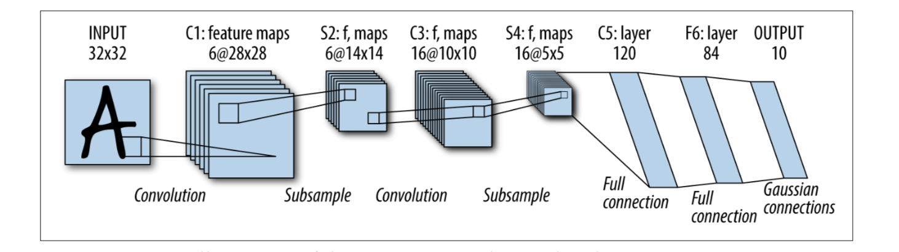
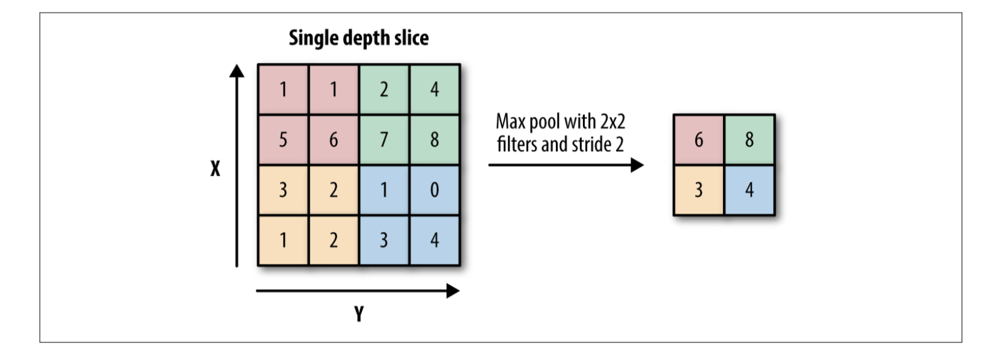
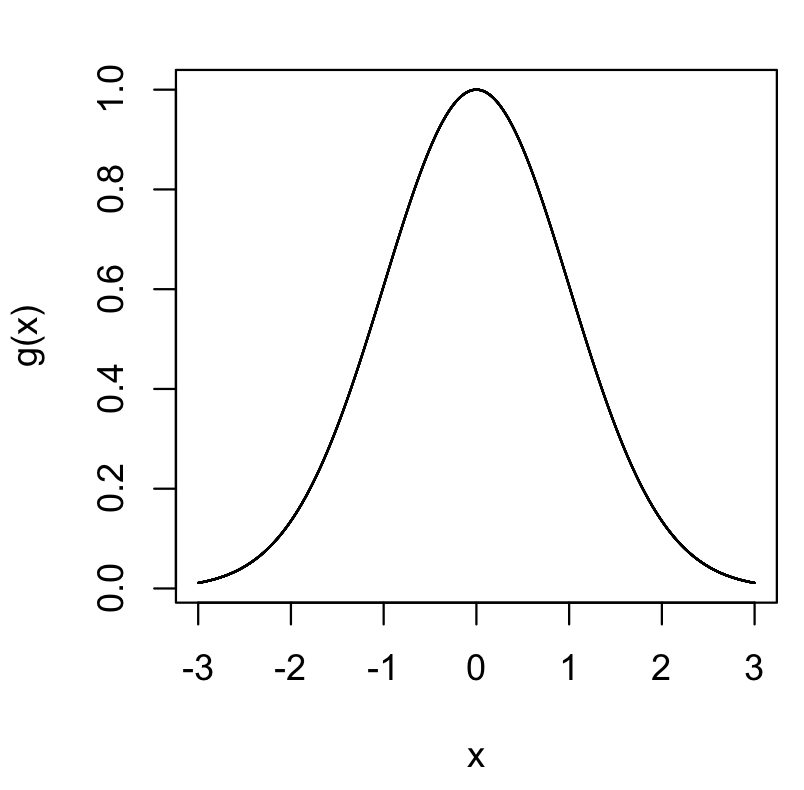
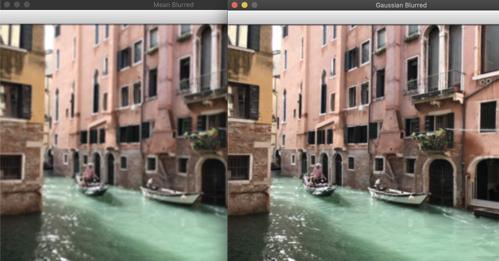
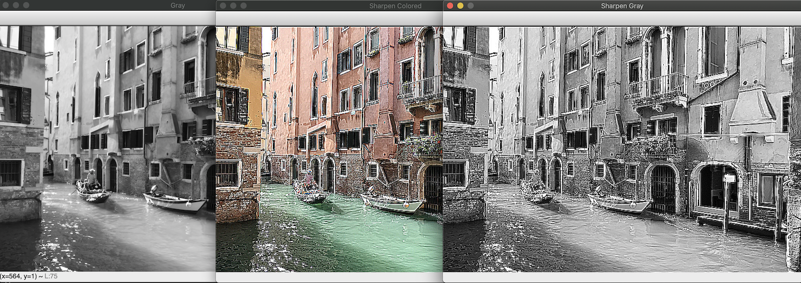
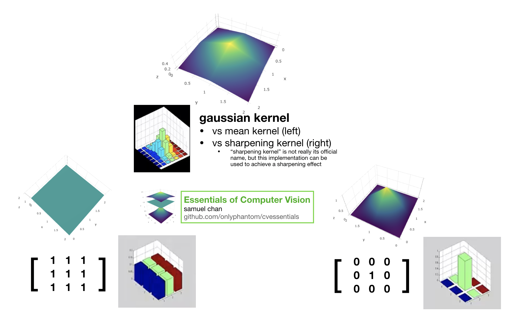

# Kernels
## Definition
When performing an arithmetic computation on a given image, one approach is to apply said computation in a neighborhood-by-neighborhood manner. This approach is very braodly termed as a **convolution**. In other words, convolution is an operation between every part of an image ("pixel neighborhood") and an operator ("kernel")[^1][^2].

As the computation slides over each pixel neighborhood, we perform some arithmetic using the kernel, with the kernel typically being represented as a matrix or a fixed size array. 

This kernel describes how the pixels in that neighborhood are combined or transformed to yield a corresponding output.

- [ ] [Watch Kernel Convolution Explained Visually](https://www.youtube.com/watch?v=WMmHcrX4Obg)

    <iframe width="560" height="315" src="https://www.youtube.com/embed/WMmHcrX4Obg" frameborder="0" allow="accelerometer; autoplay; encrypted-media; gyroscope; picture-in-picture" allowfullscreen></iframe>

### Mathematical Definitions
You will notice from the video that the output image now has a **shape that is smaller** than the original input. Mathematically, the shape of this output would be:

$$(\frac{X_m-M_i}{s_x})+1, (\frac{X_n-M_j}{s_y})+1$$

Where the input matrix has a size of $(X_m, X_n)$, the kernel $M$ is of size $(M_i, M_j)$, $s_x$ represents the stride over rows while $s_y$ represents the stride over columns. 

In the linked video, we are sliding the kernel on both the x- and y- direction by 1 pixel at a time after each computation, giving a value of 1 for $s_x$ and $s_y$. The input matrix in our video is of size 5, and our kernel is of size 3x3, giving us an output size of:

$$(\frac{5-3}{1}+1, \frac{5-3}{1}+1)$$

Expressed mathematically, the full procedure as implemented in `opencv`looks like this for a convolution:

$H(x, y) = \sum^{M_i-1}_{i=0}\sum^{M_j-1}_{j=0} I(x+i-a_i, y+j-a_j)K(i,j)$

We'll see the step-by-step given a kernel represented by matrix M:

$$M = \begin{bmatrix} 1 & 2 & 0 \\ -1 & 3 & 0 \\ 0 & -1 & 0  \end{bmatrix}$$

1. Place the kernel anchor (in this case, $3$) on top of a determined pixel, with the rest of the kernel overlaying the corresponding local pixels in the image
    - Typically the kernel anchor is the _central_ of the kernel
    - Typically the "determined pixel" at the first step is the most upperleft region of the image

2. Multiply the kernel coefficients by the corresponding image pixel values and sum the result  

3. Replace the value at the location of the _anchor_ in the input image with the result

4. Repeat the process for all pixels by sliding the kernel across the entire image, as specified by the stride

#### A Note on Padding
Keen readers may observe from executing `meanblur_02.py` that the original dimension of our image is preserved _after_ the convolution. This may seem unexpected given what we know about the formula to derive the output dimension. 
As it turns out, to preserve the dimension between the input and output images, a common technique known as "padding" is applied. From the documentation itself, 
> For example, if you want to smooth an image using a Gaussian 3 * 3 filter, then, when processing the left-most pixels in each row, you need pixels to the left of them, that is, outside of the image. You can let these pixels be the same as the left-most image pixels (“replicated border” extrapolation method), or assume that all the non-existing pixels are zeros (“constant border” extrapolation method), and so on. 

The various border interpolation techniques available in `opencv` are as below (image boundaries are denoted with '|'):

 - BORDER_REPLICATE:
    - `aaaaaa|abcdefgh|hhhhhhh`
 - BORDER_REFLECT:
    - `fedcba|abcdefgh|hgfedcb`
 - BORDER_REFLECT_101:
    - `gfedcb|abcdefgh|gfedcba`
 - BORDER_WRAP:
    - `cdefgh|abcdefgh|abcdefg`
 - BORDER_CONSTANT:
    - `iiiiii|abcdefgh|iiiiiii`  with some specified 'i'
 
It is useful to remember that OpenCV only supports convolving an image where the dimension of its output matches that of the input, so in almost all cases we need a way to extrapolate an extra layer of pixels around the borders. To specify an extrapolation method, supply the filtering method with an extra argument:
 - `cv2.GaussianBlur(..., borderType=BORDER_CONSTANT)`

 Given what we've just learned, we can rewrite our formula to determine the output dimensions more generally and this time incorporating the padding technique:

 $$(\frac{X_m - M_i + 2P_i}{s_x})+1, (\frac{X_n-M_j + 2P_j}{s_y})+1$$

##### Dive Deeper
 Before moving on to the next section, try and think through the following problem:

 In the case on a 333x333 input image, with a strides of 1 using a kernel of size 5*5, what is the amount of zero-padding you should add to the borders of your image such that the output image is also 333x333?

- [ ] Done, I've understood the convolution operation!

## Smoothing and Blurring
To fully appreciate the idea of kernel convolutions, we'll see some real examples. We'll use the `cv2.filter2D` to convolve over our image using the following kernel:

$$K = \frac{1}{5\cdot5} \begin{bmatrix} 1 & 1 & 1 & 1 & 1 \\ 1 & 1 & 1 & 1 & 1 \\ 1 & 1 & 1 & 1 & 1 \\ 1 & 1 & 1 & 1 & 1  \\ 1 & 1 & 1 & 1 & 1  \end{bmatrix}$$

The kernel we specified above is equivalent to a _normalized box filter_ of size 5. Having watched the video earlier, you may intuit that the outcome of such a convolution is that each pixel in the input image is replaced by the average of the 5x5 pixels around it. You are in fact correct. If you are skeptical and would rather see proof of it, we'll see proof of this in the [Code Illustrations: Mean Filtering](#code-illustrations-mean-filtering) section of this coursebook.

Mathematically, by dividing our matrix by 25 (normalizing) we apply a control that stop our pixel values from being artificially increased since each pixel is now the weighted sum of its neighborhood.

> #### A Note on Terminology
> ##### Kernels or Filters?
> When all we've been talking about is kernels, why is it that we're using the "filter" terminology in `opencv` code instead? That depends on the context. In the case of a convolutional neural network, _kernel_ and _filters_ are used interchangably: they both refer to the same thing.
> Some computer vision researchers have proposed to use a stricter definition, prefering to use the term "kernel" for a 2D array of weights, like our matrix above, and the term "filter" for the 3D structure of multiple kernels stacked together[^3], a concept we'll explore further in the Convolutional Neural Network part of this course.
> 
> ##### Correlations vs Convolutions
> Imaging specialists may point to the fact that `opencv` does not mirror / flip the kernel around the anchor point and hence doesn't qualify as a convolution under strict definitions of digital imaging theory. For a pure implementation of a "convolution", you should instead `scipy.ndimage.convolve(src, kernel)` instead or use `cv2.filter2D` in conjunction with a `flip` on the kernel[^4]. This is in large part owed to the difference in scientific parlance adopted by the various scientific communities, a phenomenon more common than you'd expect. As an additional example, deep learning scientists usings convolutional neural network (CNN) generally refer to a non-flipped kernel when performing convolution.

#### Code Illustrations: Mean Filtering
1. `meanblur_01.py` demonstrates the construction of a 5x5 mean average filter using `np.ones((5,5))/25`. Because every coefficient is basically the same, this merely replaces the value of each pixel in our input image with the average of the values in its 5x5 neighborhood. 

```py
img = cv2.imread("assets/canal.png")
mean_blur = np.ones((5, 5), dtype="float32") * (1.0 / (5 ** 2))
smoothed_col = cv2.filter2D(img, -1, mean_blur)
```

Alternatively, we can be explicit in our creation of the 5x5 kernel using `numpy`'s array:
```py
mean_blur = np.array(
[[0.04, 0.04, 0.04, 0.04, 0.04],
    [0.04, 0.04, 0.04, 0.04, 0.04],
    [0.04, 0.04, 0.04, 0.04, 0.04],
    [0.04, 0.04, 0.04, 0.04, 0.04],
    [0.04, 0.04, 0.04, 0.04, 0.04]])
```

2. To be fully convinced that the mean filtering operation is doing what we expect it to do, we can inspect the pixel values before and after the convolution, to verify that the math checks out by hand. We do this in `meanblur_02.py`.

    ```py
    img = cv2.imread("assets/canal.png")
    gray = cv2.cvtColor(img, cv2.COLOR_BGR2GRAY)
    print(f'Gray: {gray[:5, :5]}')
    # [[ 31  27  21  17  21]
    # [ 77  85  86  87  90]
    # [205 205 215 227 222]
    # [224 230 222 243 249]
    # [138 210 206 218 242]]
    for i in range(3):
        newval = np.round(np.mean(gray[:5, i:i+5]))
        print(f'Mean of 25x25 pixel #{i+1}: {np.int(newval)}')
    # output:
    # Mean of 25x25 pixel #1: 152
    # Mean of 25x25 pixel #2: 158
    # Mean of 25x25 pixel #3: 160
    ```
    The code above shows that the output of such a convolution operation beginning at the top-left region of the image would be 152. As we slide along the horizontal direction and re-compute the mean of the neighborhood, we get 158. As we slide our kernel along the horizontal direction for a second time and re-compute the mean of the neighborhood we obtain the value of 160. 
    
    If you prefer you can verify these values by hand, using the raw pixel values from `gray[:5, :5]` (5x5 top-left region of the image).

    ```py
    mean_blur = np.ones(KERNEL_SIZE, dtype="float32") * (1.0 / (5 ** 2))
    smoothed_gray = cv2.filter2D(gray, -1, mean_blur)
    print(f'Smoothed: {smoothed_gray[:5, :5]}')
    # output:
    # [[122 123 125 127 128]
    # [126 127 128 131 132]
    # [148 149 152 158 160]
    # [177 179 184 196 202]
    # [197 199 204 222 229]]
    ```
    Notice that from the output of our mean-filter, the first anchor (center of the neighborhood) has transformed from 215 to 152, and the one to the right of it has transformed from 227 to 158, and so on. The math does work out and you can observe the blur effect directly by running `meanblur02.py`.

3. As it turns out, `opencv` provides a set of convenience functions to apply filtering onto our images. All the three approaches below yield the same output, as can be verified from the output pixel values after executing `meanblur_03.py`:

    ```py
    # approach 1
    mean_blur = np.ones(KERNEL_SIZE, dtype="float32") * (1.0 / (5 ** 2))
    smoothed_gray = cv2.filter2D(gray, -1, mean_blur) 

    # approach 2
    smoothed_gray = cv2.blur(gray, KERNEL_SIZE)
    
    # approach 3
    smoothed_gray = cv2.boxFilter(gray, -1, KERNEL_SIZE)
    ```

There are several types of kernels we can apply to achieve a blur filter on our image. The averaging filter method serves as a good introductory point because it is easy to intuit about, but it is good to know that `opencv` provides a collection of convenience functions, each being an implementation of some blurring filter. See [Handy kernels for image processing](#handy-kernels-for-image-processing) for a list of smoothing kernels implemented in `opencv`.

## Role in Convolutional Neural Networks
Earlier, it was said that kernels play a play integral role in all modern convolutional neural networks architecture. Using TensorFlow, one will rely on the `tf.nn.conv2d` function to perform a 2D convolution. The syntax looks like this:
```py
tf.nn.conv2d(
    input,
    filter,
    strides,
    padding,
    use_cudnn_on_gpu=None,
    data_format=None,
    name=None   
)
```

Where:
- `input` is assumed to be a tensor of shape `(batch, height, width, channels)` where `batch` is the number of images in a minibatch  
- `filter` is a tensor of shape `(filter_height, filter_width, channels, out_channels)` that specifies the learnable weights for the nonlinear transformation learned in the convoliutional kernel  
- `strides` contains the filter strides and is a list of length 4 (one for each input dimension)  
- `padding` determines whether the input tensors are padded (with extra zeros) to guarantee the output _from the convolutional layer_ has the same shape as the input. `padding="SAME"` adds padding to the input and `padding="VALID"` results in no padding

Worthy to note is that the `input` and `filters` parameters follow what we've implemented using `opencv` thus far. When we're applying a filter like the mean blur example earlier, we slide our kernel along the `stride` of 1. In TensorFlow code, we would have set `strides=[1,1,1,1]` such that the kernel would slide by 1 unit across all 4 dimensions (x, y, channel, and image index).

Example of a Convolutional Neural Network architecture[^5]:


Notice from the image that the dimension of our output from the first convolution layer is smaller (28x28) than its input (32x32) when we perform the operation without padding. `C1` and `C3` are examples of this in the above illustration.

In `S1` and `S2`, we're applying a max-pooling filter to down-sample our image representation, allowing our network to learn the parameters from the higher-order representations in each region of the image. An example operation is depicted below:
 


## Handy kernels for image processing
- Averaging Filter: `cv2.blur(img, KERNEL_SIZE)`  
    - As seen in `meanblur_03.py`, replace each pixel with the **mean** of its neighboring pixels
- Median Filter: `cv2.medianBlur(img, KERNEL_SIZE)`
    - Replace each pixel with the **median** of its neighboring pixels
- Gaussian Filter: `cv2.GaussianBlur(img, KERNEL_SIZE, 0)`
- Bilateral Filter: `cv2.bilateralFilter(img, d, sigmaColor, sigmaSpace)`
    - An edge-preserving smoothing that aims to keep edges sharp


#### Gaussian Filtering 
Gaussian filter deserves its own section given its prevalence in image processing, and is achieved by convolving each point in the input array (read: each pixel in our image) with a _Gaussian kernel_ and take the sum of them to produce the output array.

If you remember your lessons from statistics, you may recall a 1D gaussian distribution looks like this:


For completeness' sake, the code to graph the distribution above is in `utils/gaussiancurve.r`.

For a 1-dimensional image, the pixel located in the middle would be assigned the largest weight, with the weight of its neighbours decreasing as the spatial distance between them and the center pixel increases. 

For the mathematically inclined, the graphed distribution above is generated from the Gaussian function[^6]:

$$g(x) = e^{\frac{-x^2}{2\sigma^2}}$$

Where $x$ is the spatial distance between the center pixel and the corresponding neighbor unit.

For a 1D kernel of size 7, each pixel would therefore be weighted accordingly:

$$g(x) = \begin{bmatrix}.011 & .13 & .6 & 1 & .6 & .13 & .011\end{bmatrix}$$

The above should not be hard to intuit about, as if we refer back to the graphed distribution we can see that the center pixel (at position x=0) the $g(x)$ would evaluate to a value of $1$.

```py
import numpy as np
weights = []
sd = 1
for i in range(4):
    weights += [np.round(np.exp((-i**2)/(2*sd**2)),3)]
print(weights)
# output:
# [1.0, 0.607, 0.135, 0.011]
```

For a 2D kernel, the formula would take the form of:
$$g(x,y) = e^{\frac{-(x^2+y^2)}{2\sigma^2}}$$

When we compare the output of a mean filter to a gaussian filter, as in the example script in `gaussianblur_01.py`, we can then observe the difference in output visually:



This should also come as little surprise, since the mean filter just replace each pixels with the average values of its neighboring pixels, essentially giving a coefficient of 1 (without normalized) to a grid of 5x5 pixels.  

Where on the other hand, gaussian filters **weigh pixels using a gaussian distribution** (think: bell curve in a 2d space) around the center pixel such that farther pixels are given a lower coefficient than nearer ones. 


#### Sharpening Kernels
The opposite of blurring would be sharpening. There are again several approaches to this, and we'll start by looking at specifically two of them.

The first approach relies on the familiar `cv2.filter2D()` function to perform the following kernel and is implemented in `sharpening_01.py`:
$$K = \begin{bmatrix} -1 & -1 & -1 \\ -1 & 9 & -1 \\ -1 & -1 & -1 \end{bmatrix}$$

The outcome:



##### Approximate Gaussian Kernel for Sharpening
We can apply the same principles behind a Gaussian kernel for sharpening operations (as opposed to blurring). The full script is in `sharpening_02.py` but the essential parts are as follow:

```py
approx_gaussian = (
    np.array(
        [
            [-1, -1, -1, -1, -1],
            [-1, 2, 2, 2, -1],
            [-1, 2, 8, 2, -1],
            [-1, 2, 2, 2, -1],
            [-1, -1, -1, -1, -1],
        ]
    )/ 8.0
)
sharpen_col = cv2.filter2D(img, -1, approx_gaussian)
```

Notice how this method uses an approximate Gaussian kernel and that the result is an overall more natural smoothing:


The second approach is known as "unsharp masking", derived from that fact that the technique uses a blurred, or "unsharp", negative image to create a mask of the original image[^7]. This technique is one of the oldest tool in photographic processing (tracing back to 1930s) and popular tools such as Adobe Photoshop and GIMP have direct implementations of it named, appropriately, Unsharp Mask. 

Lifted straight from the Wikipedia article itself, a "typical blending formula for unsharp masking is **sharpened = original + (original - blurred) * amount**". **Amount** represents how much contrast is added to the edges.

To rewrite the formula, we get:
$$\begin{aligned}
Sharpened & = O + (O-B) \cdot a \\
& = O + Oa - Ba \\
& = O (1+a) + B(-a)\end{aligned}$$

Where $a$ is the amount, $B$ is the blurred image (mask) and $O$ is the original image. The final form is convenient because we can plug it into `cv2.addWeighted` and get an output. From OpenCV's documentation, the function `addWeighted` calculates the weighted sum of two arrays as follows:
$$dst(I) = saturate(src1(I) * alpha + src2(I) * beta + gamma)$$

When you perform the arithmetic above, you will find that the values (eg. `src1(I) * alpha` when alpha is > 1.5 will produce values greater than 255) may fall outside the range of 0 and 255. Saturation clips the value in a way that is synonymous to the following:

$$Saturate(x) = min(max(round(r), 0), 255)$$

The following code demonstrates the unsharp masking technique:
```py
img = cv2.imread("assets/sarpi.png")

amt = 1.5
blurred = cv2.GaussianBlur(img, (5,5), 10)
unsharp = cv2.addWeighted(img, 1+amt, blurred, -amt, 0)
unsharp_manual = np.clip(img * (1+amt) + blurred * (-amt), 0, 255)
cv2.imshow("Unsharp Masking", unsharp)
```


You can find the sample code for this in `unsharpmask_01.py` (using `addWeighted`) and in `unsharpmask_02.py` (manual calculation) respectively.

## Summary and Key Points
Why go to such lengths on the mathematical ideas behind image filtering operations?

> Filtering is perhaps the most fundamental operation of image processing and computer vision. In the broadest sense of the term "filtering", the value of the filtered image at a given location is a function of the values of the input image in a small neighborhood of the same location.[^8]

It is fundamental to a host of common image processing techniques, from enhancements (sharpening, denoise, increase / reduce contrast), to edge detection, and texture detection, and in the case of deep learning, feature detections. 

To help with your recall, I made a simple illustration below:



Whenever you're ready, move on to `edgedetect.md` to learn the essentials of edge detection using kernel operations. 

## Learn-by-Building


## References
[^1]: Making your own linear filters, [OpenCV Documentation](https://docs.opencv.org/2.4/doc/tutorials/imgproc/imgtrans/filter_2d/filter_2d.html)

[^2]: Bradski, Kaehler, Learning OpenCV

[^3]: Stacks Exchange, https://stats.stackexchange.com/a/366940

[^4]: [OpenCV Documentation](http://docs.opencv.org/modules/imgproc/doc/filtering.html#filter2d)

[^5]: R.Zadeh and B.Ramsundar, TensorFlow for Deep Learning, O'Reilly Media

[^6]: Wikipedia, Gaussian function, https://en.wikipedia.org/wiki/Gaussian_function

[^7]: W.Fulton, A few scanning tips, Sharpening - Unsharp Mask

[^8]: C. Tomasi and R. Manduchi, "Bilateral Filtering for Gray and Color Images", Proceedings of the 1998 IEEE International Conference on Computer Vision, Bombay, India.
