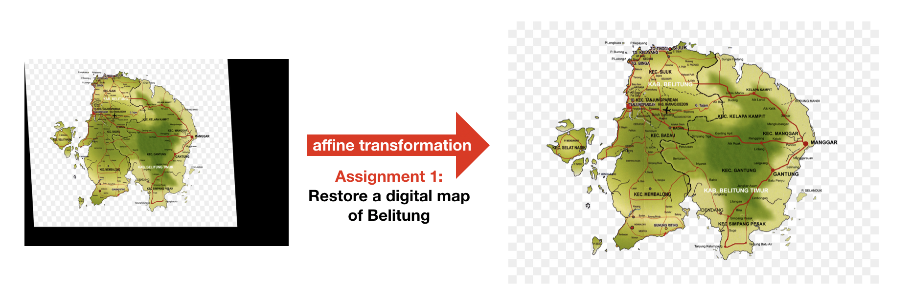

# Affine Transformation

## Week 1 Notes
Some simple set-up instructions to get us up and running for the study group on Computer Vision Essentials!
* Installing python
* Installing git
* Installing visual studio code
* Installing dependencies (`pip install -r requirements.txt`)
* Installing Markdown Preview Enhanced

## Definition
Any transformation that can be expressed in the form of a _matrix multiplication_ (linear transformation) followed by a _vector addition_ (translation). 

$$T = A \cdot \begin{bmatrix} x \\ y \end{bmatrix} + B$$

In which:

$$A = \begin{bmatrix} a_{00} & a_{01} \\ a_{10} & a_{11} \end{bmatrix};   B = \begin{bmatrix} b_{00} \\ b_{10} \end{bmatrix}$$

When concatenated horizontally, this can be expressed in a larger Matrix:

$$M = \begin{bmatrix} A & B \end{bmatrix} = \begin{bmatrix} a_{00} & a_{01} & b_{00} \\  a_{10} & a_{11} & b_{10} \end{bmatrix}$$

By the definition above (_matmul_ + _vector addition_), affine transformation can be used to achieve:
- Scaling (linear transformation)
- Rotations (linear transformation)
- Translations (vector additions)

Affine transformation preserves points, straight lines, and planes. Parallel lines will remain parallel. It does not however preserve the distance and angles between points.

We represent an Affine Transformation using a **2x3 matrix**.

### Mathematical Definitions
Consider the goal of transforming a 2D vector $X = \begin{bmatrix} x \\ y \end{bmatrix}$ using $A$ and $B$ to obtain $T$, we can do it like such:

$$T = A \cdot \begin{bmatrix} x \\ y \end{bmatrix} + B$$ 

Or equivalently:

$$T = M \cdot [x,y,1]^T = \begin{bmatrix} 
a_{00}x + a_{01}y + b_{00} \\ a_{10}x + a_{11}y + b_{10}  \end{bmatrix}$$

#### Practical Examples
In `scale_04.py` from the **Examples and Illustrations** section, you'll see that the  2x3 matrix $M$ is simply defined as such:
`np.float32([[3, 0, 0], [0, 3, 0]])`

The code above is equivalent to the one below:
```py
x = np.array([[3, 0, 0], [0, 3, 0]], dtype='float32')
# alternative:
x = np.array([[3, 0, 0], [0, 3, 0]])
x = x.astype('float32')
x.dtype # dtype('float32')
```

When you explicitly specify a 2x3 matrix, think of the first two columns as the $A$ component, or the matrix-multiplication process. The third column, naturally, represents the $B$ component, or the vector addition process. This may sound a little abstract, so I encourage you to pause and take a look at the code below:
```py
(h, w) = img.shape[:2]
mat = np.float32([[1, 0, -140], [0, 1, 20]])
translated = cv2.warpAffine(img, mat, (w, h))
cv2.imshow("Translated", translated)
```

Notice that our $A$ is an _identity matrix_ of size 2. An identity matrix is the matrix equivalent of a scalar 1. Multiplying a matrix by its identity matrix doesn't change it by anything. 

$$T  = \begin{bmatrix} 1 & 0 \\ 0 & 1 \end{bmatrix}  \cdot \begin{bmatrix} x \\ y \end{bmatrix} + \begin{bmatrix} -140 \\ 20 \end{bmatrix}$$

Which leads to:
$$T  = \begin{bmatrix} 1 \cdot x + 0 \cdot y -140 \\ 0 \cdot x + 1 \cdot y + 20 \end{bmatrix}$$

And our $B$, the vector addition component, moves each pixel -- or more formally, translate each pixel -- on the image by -140 in the $x$ direction and 20 on the $y$ direction. Find the full code example on `translate_01.py`.


## Motivation
1. Imaging systems in the real-world are often subject to **geometric distortion**. The distortion may be introduced by perspective irregularities, physical constraints (e.g camera placements), or other reasons. 

2. In the field of GIS (geographic information systems), routinely one would use affine transformation to "convert" geographic coordinates into screen coordinates such that it can **be displayed and presented** on our handheld / navigational devices. 

3. One may also overlay coordinate data on a spatial data that reference a different coordinate systems; Or to **"stitch" together** different sources of data using a series of transformation

These are but a handful of examples where one may expect to see routine use of affine transformations. If you're spending any amount of time in computer vision, a high degree of familiarity with these remapping routines in OpenCV will come in very handy.

In your learn-by-building section, you will find a less-than-perfectly-digitalized map, `belitung_raw.jpg`. Your job is to apply what you've apply the necessary affine transformation to correct its perspective distortion and the resize the map accordingly.

## Getting Affine Transformation 
Given the importance of such a relation between two images, it should come as no surprise that `opencv` packs a number of convenience methods to help us specify this transformation. The two common use-cases are:
- 1. We **specify** our 2D vector representing the original image, $X$ and our 2x3 transformation matrix $M$ constructed in `numpy`.
    - Example code: 
    ```py
    img = cv2.imread("our_image.png")
    mat = np.float32([[3, 0, 0], [0, 3, 0]])
    result = cv2.warpAffine(img, M=mat, dsize=(600, 600))
    cv2.imshow("Transformed", result)
    ```

- 2.  We **obtain** our 2x3 transformation matrix $M$ by deriving the geometric relation using three points. Three points form a triangle, which is the minimal case required to find the affine transformation before applying the transformation to the whole image.
    - Example code: 
    ```py
    img = cv2.imread("our_image.png")
    coords_s = np.float32([[10, 10], [80, 10], [10, 80]])
    coords_d = np.float32([[10, 10], [95, 10], [10, 80]])
    mat = cv2.getAffineTransform(src=coords_s, dst=coords_d)
    result = cv2.warpAffine(img, M=mat, dsize=(200, 200))
    cv2.imshow("Transformed", result)
    ```
    Have we printed out `mat` from the snippet of code above, we would see a 2x3 matrix that looks like this:
    ```py
    [[ 1.21428571  0.         -2.14285714]
     [ 0.          1.          0.        ]]
    ```

- 2b _[Optional]_. As an extension to point (2) above, consider how we would use `cv2.warpAffine` to achieve a 90 degree clockwise rotation. If you have attended my Unsupervised Learning course from the Machine Learning Specialization, you will undoubtedly have seen this quick reference:
     

    To plug that directly into the $A$ of our original formula:
    $$T = A \cdot \begin{bmatrix} x \\ y \end{bmatrix} + B$$

    A 90-degree clockwise rotation could be implemented as a 270-degree anti-clockwise rotation. Let's see this implementation in `opencv`:

    - Example code: 
    ```py
    img = cv2.imread("assets/cvess.png")
    (h, w) = img.shape[:2]
    center = (w // 2, h // 2)
    mat3 = cv2.getRotationMatrix2D(center, angle=270, scale=1)
    print(f'270 degree anti-clockwise: \n {np.round(mat3, 2)}')
    rotated = cv2.warpAffine(img, mat, (w, h))
    cv2.imshow("Rotated", rotated)
    # 
    # print output:
    # 
    # 270 degree anti-clockwise: 
    # [[ -0.  -1. 400.]
    # [  1.  -0.   0.]] 
    ```

    We learned earlier that:
    $$M = \begin{bmatrix} A & B \end{bmatrix} = \begin{bmatrix} a_{00} & a_{01} & b_{00} \\  a_{10} & a_{11} & b_{10} \end{bmatrix}$$

    So $A$ would be the `[[0, -1], [1, 0]]` and $B$ would be `[400, 0]`. Fundamentally, the `cv2.getRotationMatrix2D` is still applying an affine transformation to map the pixels from one point to another using a 2x3 matrix.

    - Skeptical and want further mathematical proof? 
        - Hop to the **Trigonometry Proof** section. 
    - Want to experiment? 
        - Modify the script in `rotate_01.py` to obtain $M$ for a 180-degree rotation, and a 30-degree counter-clockwise rotation

### Dive Deeper

Let's also look at another application of `getAffineTransform` to strengthen our understanding. 

Supposed we specify $M$ to be `mat = np.float32([[1, 0, 0], [0, 1, 0]])`, what do you expect the transformation to be? 

Take a minute to discuss with your classmates or refer back to the Mathematical Definitions section above and try to internalize this before moving forward.

To verify your answer, run `scale_03.py` and see if your hunch was right.

For an extra challenge, let's assume `our_image.png` is an image of 200x200. Pay attention to the specification of `mat` ($M$), what do you expect the outcome `result` to be? 

Take a minute to discuss before moving forward.

```py
img = cv2.imread("assets/our_image.png")
cv2.imshow("Original", img)

# custom transformation matrix
mat = np.float32([[3, 0, 0], [0, 3, 0]])
print(mat)
result = cv2.warpAffine(img, M=mat, dsize=(200, 200))
```

You may have expected the 2x3 matrix `mat` to have a scaling effect on our original image. However, the required argument of `dsize` in our `warpAffine()` call constrained the output to its original dimension, 200x200, thus "cropping out" only the top left corner of the image. 

Supposed we'll like to see the transformed image (scaled by 3x) in its entirety, how would we have changed the value passed to the `dsize` argument? 

Refer to `scale_04.py` to verify that you've got this right.

#### Trigonometry Proof
_This section is optional; you may choose to skip this section._

- [ ] [Watch Rotation Matrix Explained Visually](https://www.youtube.com/watch?v=tIixrNtLJ8U)
    <iframe width="560" height="315" src="https://www.youtube.com/embed/pWfXR_HmyUw" frameborder="0" allow="accelerometer; autoplay; encrypted-media; gyroscope; picture-in-picture" allowfullscreen></iframe>

    - [Bahasa Indonesia voiceover](https://www.youtube.com/watch?v=pWfXR_HmyUw) is also available

If you're done watching the video, see the same example being presented in code:
```py
a = np.float32([[0, -1], [1, 0]])
x = np.float32([3, 6])
np.matmul(a, x)
# output:
# array([-6.,  3.], dtype=float32)
```

## Code Illustrations
- Code example of using `getRotationMatrix2D()` to get a 2x3 matrix: **`rotate_01.py`**  
- Code example of using three points to `getAffineTransform()`, obtaining a 2x3 matrix of `[[1,0,0], [0,1,0]]` (no transformation): `scale_01.py`
- Code example of explicit specification for our 2x3 matrix using `np.float32([[1,0,0], [0,1,0]])`: **`scale_02.py`**
- Code example of setting the `dsize` parameter in `cv2.warpAffine` without transformation: **`scale_03.py`**
- Code example of a scale transformation and setting the `dsize` parameter accordingly: **`scale_04.py`**
- Code example of using three points to `getAffineTransform()`, obtaining a 2x3 matrix of `[[1,0,0], [0,1,0]]`: **`scale_05.py`**  
- Code example of translating (shifting an image) using a 2x3 matrix: **`translate_01.py`**

## Summary and Key Points
1. Images from imaging systems and capturing systems are often "subject to geometric distortion introduced by perspective irregularities"[^1] or "deformations that occur with non-ideal camera angles"[^2].  

2. In the case of translation or scaling, we typically specify our 2x3 matrix using `np.float()` and feed this matrix to `cv2.warpAffine()`  

3. In the case of rotation, we typically use the convenience function `cv2.getAffineTransform()` to obtain the 2x3 matrix before feeding it to `cv2.warpAffine()`

> `cv2.getAffineTransform(src, dst)`
>
> **Parameters:**
> - **src** - Coordinates of triangle vertices in the source image
> - **dst** - Coordinates of corresponding triangle vertices in the destination triange


## Learn-by-Building
In the `homework` directory, you'll find a digital map `belitung_raw.jpg`. Your job is to apply what you've learned in this lesson to restore the map by correcting its skew and resize it appropriately. 




## References
[^1]: Fisher, R., Perkins, S., Walker, A., Wolfart, E., Hypermedia Image Processing Learning (HIPR2) Resources, 2003

[^2]: [MathWorks](https://www.mathworks.com/discovery/affine-transformation.html), Linear mapping method using affine transformation, Affine Transformation